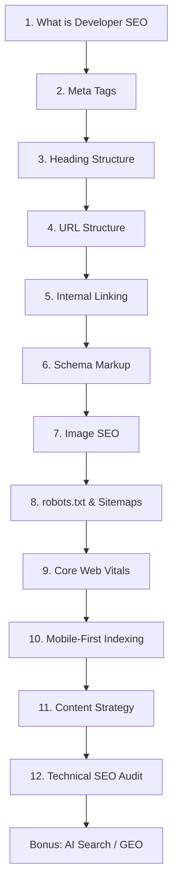

# SEO Plugin Implementation Plan

> **For agentic workers:** REQUIRED SUB-SKILL: Use superpowers:subagent-driven-development (recommended) or superpowers:executing-plans to implement this plan task-by-task. Steps use checkbox (`- [ ]`) syntax for tracking.

**Goal:** Build an SEO audit plugin for claude-plugins that produces scored, structured SEO reports at `docs/sites/{slug}/seo/`, integrates with beacon and reframe, and includes a paidagogos learning package for developer SEO mastery.

**Architecture:** Pure-document plugin with 3 skills (site-audit orchestrator, technical audit, on-page audit), 4 Python scripts for programmatic analysis, templates for structured output, and a curriculum reference file for paidagogos integration. The plugin reuses beacon's existing recon data and chrome-devtools MCP's performance trace tools. CLI tools from nikai (`tools/cli/`) provide enrichment data via subprocess calls.

**Tech Stack:** Claude Code plugin system, JSON manifests, Markdown skills/templates, Python scripts (httpx, beautifulsoup4, json), Gherkin acceptance criteria, Mermaid diagrams in curriculum content

---

## Execution Order

The user specified this delivery sequence. Each phase ships as **one PR opened, reviewed, and merged before the next phase begins** — no parallel branches, no stacked PRs.

### Phase 0: Inline-Code Patches (no PR — pre-plan fix-up)

Fix the four bugs identified in plan review (dead OG-completeness branch, protocol-relative link handling, HowTo deprecated rule naming, required-property scoring baseline). Apply the fixes already incorporated into Task 4/5/6/7/8 inline code blocks. **No new files** at this stage — just bring the inline code blocks up to spec before any executor runs them.

### Phase 1: Linear Project Setup (Task 18)

Create the Linear project and all issues before any code.

### Phase 2: Documentation + Design (Tasks 16, 17) — PR #1

Open one PR containing both docs and design. No code yet — pure Markdown. Branch from `main` using naming `feat/seo-docs`. After the PR opens, review against the spec, merge, then start Phase 3.

### Phase 3: Learning Material (Task 15) — PR #2

Open one PR for the paidagogos SEO Developer Mastery curriculum. Branch `feat/seo-curriculum`. Review, merge, then start Phase 4.

### Phase 4: Core Plugin Implementation (Tasks 1–14) — PR #3

Open one PR for the entire plugin code (manifest, scripts, skills, agents, templates, commands). Branch `feat/seo-plugin`. The design doc from PR #1 must already be merged before this PR opens — the reviewer compares code to design during PR review. Review, merge, then start Phase 5.

### Phase 5: Validation (Task 19) — follow-up commits on `main`

Test the plugin on `trustyourphysio-com`. Either merge any discovered fixes as direct commits to `main`, or open a small `fix/seo-validation` PR if the fixes are non-trivial. Refine thresholds based on real output.

---

## PR Discipline (applies to Phases 2, 3, 4)

- Single branch per phase, branching from `main`
- PR description references the originating plan: `Implements Phases 2-3 of docs/superpowers/plans/2026-07-12-seo-plugin.md`
- Reviewer checks: spec coverage, type consistency, placeholder scan
- Do not start the next phase's PR until the previous one is merged
- If review reveals issues, fix them in the same PR (force-push is fine for unmerged branches)

---

## Research Sources

| Source | What it provides | Location |
|--------|-----------------|----------|
| nikai SEO tools vault | 72 SEO tool guides, CLI tools, methodology docs | `nikai/knowledge/growth-marketing/seo/` |
| nikai CLI tools | 231 Python CLIs including serper, pagespeed, builtwith, google_suggest | `nikai/tools/cli/` |
| nikai SEO methodologies | Developer blog SEO, structured data, robots.txt analysis, sitemap mining | `nikai/knowledge/methodologies/` |
| nikai research guides | SEO audit automation, free-for-dev SEO picks, programmatic SEO | `nikai/research/guides/` |
| claude-seo (11.1k stars) | 3-layer architecture, 25 sub-skills, weighted scoring model | GitHub: AgriciDaniel/claude-seo |
| seo-mcp (MIT) | 28 SEO rules, worker_threads parallel scanning, no-API-key philosophy | GitHub: Stackwise-digital/seo-mcp |
| mcp-seo (AGPL) | 18 MCP tools, Pydantic models, dual JSON+Markdown output | REFERENCE ONLY — AGPL is incompatible with MIT-licensed plugins. Use as design inspiration; do not copy code, prompts, schemas, or scoring weights verbatim. |
| seofordev (MIT) | Go CLI, AI-ready prompt export, localhost-first, IndexNow | GitHub: ugolbck/seofordev |
| lighthouse-mcp (MIT) | Thin Lighthouse CLI wrapper for MCP | GitHub: priyankark/lighthouse-mcp |
| course.careers SEO roadmap | 5-phase learning path, course recommendations | course.careers/guides/seo-roadmap-2026 |
| Google Search Central | Official SEO docs, structured data guide, developer guide | developers.google.com/search |
| HubSpot Academy | Free SEO certification (3.5 hrs), AEO fundamentals | academy.hubspot.com |
| Semrush Academy | 95+ free courses, SEO fundamentals through AI search | semrush.com/academy |
| Ahrefs Academy | Free courses, certification exam, API docs | ahrefs.com/academy |
| paidagogos skill | Lesson SurfaceSpec schema, curriculum design patterns | plugins/paidagogos/ |
| paidagogos:wiki design | Course SurfaceSpec (vk://schemas/course.v1.json), llms.txt grounding | docs/superpowers/specs/2026-04-18-paidagogos-wiki-design.md |

---

## File map

Files to create (all inside `plugins/seo/`):

```
.claude-plugin/plugin.json              — manifest: skills[], agents[]
skills/site-audit/SKILL.md              — ★ orchestrator: 8-phase audit workflow
skills/site-audit/references/
  scoring-model.md                      — 0-100 weighted scoring breakdown
  free-tools.md                         — which free APIs to use, fallback chains
  cli-tools.md                          — how to invoke nikai CLI tools
  phase-detail.md                       — detailed per-phase instructions
  beacon-integration.md                 — how to read beacon research/ data
  reframe-integration.md                — how to populate reframe current-critique
skills/technical-audit/SKILL.md         — technical SEO specialist
skills/technical-audit/references/
  rules-meta.md                         — 12 meta tag rules with thresholds
  rules-content.md                      — 9 content rules
  rules-technical.md                    — 10 technical rules
  rules-performance.md                  — 6 performance rules
skills/on-page-audit/SKILL.md           — on-page + content specialist
skills/on-page-audit/references/
  heading-structure.md                  — heading hierarchy analysis patterns
  schema-validation.md                  — JSON-LD extraction + validation
  internal-linking.md                   — internal link analysis patterns
templates/
  INDEX.md.template                     — summary, overall score, top 5
  seo-report.md.template                — full scored report
  technical-audit.md.template           — CWV, crawlability, indexation
  on-page-audit.md.template             — meta, headings, schema, content
scripts/
  meta_audit.py                         — title/desc/OG/Twitter/canonical checker
  heading_audit.py                      — heading hierarchy analysis
  structured_data_validate.py           — JSON-LD extraction + schema validation
  composite_scorer.py                   — weighted scoring engine
commands/
  seo-audit.md                          — /seo:audit command definition
agents/
  seo-analyst.md                        — subagent for parallel audits
```

Files to create (inside `plugins/paidagogos/`):

```
skills/paidagogos-micro/references/curricula/
  seo-developer-mastery.md              — ★ curriculum definition + dependency graph
```

Files to create (inside `docs/plugins/seo/`):

```
_index.md                               — AI agent entrypoint
ROADMAP.md                              — versioned roadmap with status legend
DECISIONS.md                            — architectural decisions
specs/
  site-audit.feature                    — BDD acceptance criteria
plans/
  2026-07-12-seo-v0.1.0-implementation.md — this file (link back)
designs/
  2026-07-12-seo-v0.1.0-design.md       — design document
```

Files to create (inside `docs/sites/{slug}/seo/`):

```
INDEX.md                                — per-site summary, score, top 5
seo-report.md                           — full scored report
technical-audit.md                      — CWV + crawlability data
on-page-audit.md                        — meta + headings + schema data
```

---

## Task 1: Plugin manifest

**Files:**
- Create: `plugins/seo/.claude-plugin/plugin.json`

- [ ] **Step 1: Create the manifest**

```json
{
  "name": "seo",
  "version": "0.1.0",
  "author": "neotherapper",
  "description": "Score any site's SEO health — technical audits, on-page analysis, structured data validation, and Core Web Vitals. Callable by beacon and reframe.",
  "skills": [
    {
      "name": "site-audit",
      "command": "/seo:audit",
      "description": "Use when the user asks to audit a site's SEO, check SEO health, run an SEO analysis, score a site's SEO, or map SEO issues. Produces a scored report at docs/sites/{slug}/seo/."
    },
    {
      "name": "technical-audit",
      "command": "/seo:technical",
      "description": "Use when the user asks specifically about technical SEO — crawlability, indexation, Core Web Vitals, robots.txt, sitemaps, structured data validation."
    },
    {
      "name": "on-page-audit",
      "command": "/seo:on-page",
      "description": "Use when the user asks about on-page SEO — meta tags, headings, content signals, internal linking, Open Graph, Twitter Cards."
    }
  ],
  "agents": [
    {
      "name": "seo-analyst",
      "description": "Runs a focused SEO analysis dimension (technical, on-page, content, schema). Returns structured findings with severity ratings."
    }
  ],
  "commands": [
    {
      "name": "seo-audit",
      "command": "/seo:audit",
      "description": "Run a full SEO audit on a URL. Produces scored report at docs/sites/{slug}/seo/."
    }
  ],
  "hooks": {},
  "marketplace": "claude-plugins-official"
}
```

- [ ] **Step 2: Verify manifest structure**

Run: `cat plugins/seo/.claude-plugin/plugin.json | python3 -m json.tool`
Expected: valid JSON, no errors

- [ ] **Step 3: Commit**

```bash
git add plugins/seo/.claude-plugin/plugin.json
git commit -m "feat(seo): scaffold plugin manifest with 3 skills and 1 agent"
```

---

## Task 2: Scoring model reference

**Files:**
- Create: `plugins/seo/skills/site-audit/references/scoring-model.md`

- [ ] **Step 1: Write the scoring model**

```markdown
# SEO Health Score (0-100)

## Composite Score Formula

score = Σ(category_score × weight)

## Categories and Weights

| Category | Weight | Max Points |
|----------|--------|-----------|
| Technical SEO | 25% | 25 |
| On-Page SEO | 25% | 25 |
| Structured Data | 20% | 20 |
| Content Signals | 15% | 15 |
| Performance | 15% | 15 |

## Technical SEO (25 pts)

| Check | Points | Threshold |
|-------|--------|-----------|
| robots.txt valid + accessible | 3 | 200 response, parseable |
| XML sitemap present + valid | 3 | Sitemap index parseable, URLs return 200 |
| No crawl errors | 4 | 0 4xx/5xx internal links |
| No redirect chains | 3 | 0 chains >2 hops |
| HTTPS enabled | 2 | Valid cert, no mixed content |
| Mobile-friendly | 3 | viewport meta, no horizontal scroll |
| Core Web Vitals "good" | 5 | LCP <2.5s, INP <200ms, CLS <0.1 |
| Canonical URL set | 2 | rel=canonical present and valid |

## On-Page SEO (25 pts)

| Check | Points | Threshold |
|-------|--------|-----------|
| Title tag present | 3 | Non-empty |
| Title length optimal | 3 | 50-60 chars |
| Title unique (not duplicate) | 2 | Not shared across pages |
| Meta description present | 3 | Non-empty |
| Meta description length optimal | 3 | 150-160 chars |
| Open Graph tags complete | 3 | og:title, og:description, og:image, og:url |
| Twitter Card present | 2 | twitter:card + twitter:title |
| Hreflang (if multilingual) | 2 | Correct lang/region codes |
| Language attribute on html | 2 | lang="..." present |
| Favicon present | 2 | rel="icon" or rel="shortcut icon" |

## Structured Data (20 pts)

| Check | Points | Threshold |
|-------|--------|-----------|
| JSON-LD present | 5 | At least one script[type="application/ld+json"] |
| Valid schema type | 5 | @type matches page purpose (Article, Product, etc.) |
| Required properties present | 5 | Per schema type requirements met |
| Rich results eligible | 3 | Google Rich Results Test would pass |
| No deprecated types | 2 | No deprecated schema types used |

## Content Signals (15 pts)

| Check | Points | Threshold |
|-------|--------|-----------|
| H1 exists + exactly 1 | 3 | Single H1 tag |
| Heading hierarchy logical | 3 | No skipped levels (H1→H3) |
| Alt text coverage | 3 | >90% images have alt |
| Internal links present | 3 | >0 internal links |
| Word count sufficient | 3 | >300 words (blog) / >150 words (product) |

## Performance (15 pts)

| Check | Points | Threshold |
|-------|--------|-----------|
| TTFB < 800ms | 3 | Server response time |
| Page size < 3MB | 3 | Total transfer size |
| Compression enabled | 3 | gzip or brotli |
| Cache headers present | 3 | Cache-Control or ETag |
| DOM nodes < 1500 | 3 | Page complexity |

## Rating Scale

| Score | Rating | Action |
|-------|--------|--------|
| 90-100 | Excellent | Minor optimizations only |
| 70-89 | Good | Address warnings |
| 50-69 | Needs Work | Prioritize critical issues |
| 0-49 | Critical | Major overhaul required |

## Score Output Format

The score is always presented as:

```
SEO Health Score: XX/100 (Rating)
├── Technical:   XX/25
├── On-Page:     XX/25
├── Schema:      XX/20
├── Content:     XX/15
└── Performance: XX/15
```
```

- [ ] **Step 2: Commit**

```bash
git add plugins/seo/skills/site-audit/references/scoring-model.md
git commit -m "feat(seo): add weighted 0-100 scoring model reference"
```

---

## Task 3: Free tools reference

**Files:**
- Create: `plugins/seo/skills/site-audit/references/free-tools.md`

- [ ] **Step 1: Write the free tools guide**

```markdown
# Free SEO Tools — API Keys and Fallback Chains

## Tier 0: No API Key Required

| Tool | What it does | How to use |
|------|-------------|-----------|
| HTTP fetch (curl/httpx) | HTML source, headers, status codes | Built-in to any agent |
| Google Rich Results Test | Structured data validation | Web fetch URL, parse results |
| PageSpeed Insights (unofficial) | Core Web Vitals + Lighthouse | `pagespeed.py` CLI or web fetch |
| Bing URL Inspection | Indexation status | Bing Webmaster Tools API (free key) |

## Tier 1: Free API Keys (easy to get)

| Tool | Free tier | Sign-up | What it gives |
|------|-----------|---------|--------------|
| Google Search Console | Unlimited (own sites) | google.com/webmasters | Indexation, crawl errors, performance |
| PageSpeed Insights API | 25K requests/day | cloud.google.com | CWV field data, Lighthouse scores |
| Serper.dev | 2,500 queries/month | serper.dev | SERP results, keyword data |
| Bing Webmaster Tools | Unlimited (own sites) | bing.com/webmasters | Bing indexation, backlinks |
| Google Custom Search API | 100 queries/day | cloud.google.com | Search results |

## Tier 2: Paid (for enrichment, not required)

| Tool | Cost | What it adds |
|------|------|-------------|
| DataForSEO | $0.002/task | Keyword volume, CPC, SERP analysis |
| Ahrefs API | $99/mo+ | Backlink profile, DA/PA |
| Semrush API | $130/mo+ | Competitor analysis, keyword magic |

## Fallback Chains

### Core Web Vitals
1. chrome-devtools MCP `lighthouse_audit` (best — real Lighthouse)
2. `pagespeed.py` CLI (nikai) — hits PageSpeed Insights API
3. HTTP fetch of PageSpeed Insights web UI (parse HTML)
4. Skip with `[CWV-SKIP]` signal

### Structured Data
1. Parse HTML for `<script type="application/ld+json">` (always works)
2. Google Rich Results Test API (if key available)
3. Schema.org validator (web fetch)

### SERP Position
1. `serper.py` CLI (nikai) — 2,500 free/month
2. Skip with `[SERP-SKIP]` signal

### Tech Stack Detection
1. `builtwith.py` CLI (nikai)
2. Parse HTML for generator meta tags, framework signatures
3. Skip with `[TECH-SKIP]` signal
```

- [ ] **Step 2: Commit**

```bash
git add plugins/seo/skills/site-audit/references/free-tools.md
git commit -m "feat(seo): add free tools guide with fallback chains"
```

---

## Task 4: CLI tools reference

**Files:**
- Create: `plugins/seo/skills/site-audit/references/cli-tools.md`

- [ ] **Step 1: Write the CLI tools reference**

```markdown
# CLI Tools — nikai Integration

## Available Tools

All tools live at `nikai/tools/cli/` and output JSON with `--json`.

### PageSpeed Analysis
```bash
python -m cli.pagespeed analyze --url "https://example.com" --json
# Returns: { ttfb, fcp, lcp, tbt, cls, si, speed_index, score }
```

### SERP Position Check
```bash
python -m cli.serper search --query "site:example.com" --json
# Returns: { organic: [{ position, title, link, snippet }] }
```

### Tech Stack Detection
```bash
python -m cli.builtwith detect --url "https://example.com" --json
# Returns: { technologies: [{ name, category, version }] }
```

### Google Autocomplete
```bash
python -m cli.google_suggest complete --query "seo audit" --json
# Returns: { suggestions: [...] }
```

### Google Trends
```bash
python -m cli.google_trends trends --keyword "seo tools" --json
# Returns: { timeline: [{ date, value }] }
```

### Certificate Transparency (subdomains)
```bash
python -m cli.crt_sh query --domain "example.com" --json
# Returns: { subdomains: [...] }
```

## Invocation Pattern

```python
import subprocess, json

def run_cli(tool: str, args: list) -> dict:
    """Run a nikai CLI tool and return parsed JSON."""
    cmd = ["python", "-m", f"cli.{tool}"] + args + ["--json"]
    result = subprocess.run(cmd, capture_output=True, text=True, timeout=30)
    if result.returncode != 0:
        return {"error": result.stderr, "tool": tool}
    return json.loads(result.stdout)
```

## Error Handling

- If nikai path not found: log `[CLI-UNAVAILABLE:{tool}]`, skip enrichment
- If timeout (30s): log `[CLI-TIMEOUT:{tool}]`, skip
- If non-zero exit: log `[CLI-ERROR:{tool}:{stderr}]`, skip
- Never block audit on CLI failure — always degrade gracefully
```

- [ ] **Step 2: Commit**

```bash
git add plugins/seo/skills/site-audit/references/cli-tools.md
git commit -m "feat(seo): add nikai CLI tools integration reference"
```

---

## Task 5: Meta audit script

**Files:**
- Create: `plugins/seo/scripts/meta_audit.py`

- [ ] **Step 1: Write meta_audit.py**

```python
#!/usr/bin/env python3
"""Audit meta tags, OG tags, Twitter Cards, canonical, and hreflang."""

import argparse
import json
import sys
from urllib.request import urlopen, Request
from urllib.error import URLError
from html.parser import HTMLParser


class MetaAuditParser(HTMLParser):
    def __init__(self):
        super().__init__()
        self.title = ""
        self.in_title = False
        self.meta = {}  # name/content or property/content pairs
        self.canonical = None
        self.hreflang = []
        self.lang = None
        self.favicon = False
        self.doctype = False
        self.img_count = 0
        self.img_with_alt = 0
        self.h1_count = 0
        self.headings = {}  # tag -> count
        self.in_h1 = False
        self.internal_links = 0
        self.external_links = 0
        self.base_url = ""

    def handle_starttag(self, tag, attrs):
        attrs_dict = dict(attrs)
        if tag == "title":
            self.in_title = True
        elif tag == "meta":
            name = attrs_dict.get("name", attrs_dict.get("property", ""))
            content = attrs_dict.get("content", "")
            if name:
                self.meta[name.lower()] = content
        elif tag == "link":
            rel = attrs_dict.get("rel", "")
            href = attrs_dict.get("href", "")
            if rel == "canonical":
                self.canonical = href
            elif rel == "alternate" and attrs_dict.get("hreflang"):
                self.hreflang.append({
                    "hreflang": attrs_dict["hreflang"],
                    "href": href
                })
            elif "icon" in rel:
                self.favicon = True
        elif tag == "html":
            self.lang = attrs_dict.get("lang")
        elif tag == "img":
            self.img_count += 1
            if attrs_dict.get("alt"):
                self.img_with_alt += 1
        elif tag in ("h1", "h2", "h3", "h4", "h5", "h6"):
            self.headings[tag] = self.headings.get(tag, 0) + 1
            if tag == "h1":
                self.h1_count += 1
                self.in_h1 = True
        elif tag == "a":
            href = attrs_dict.get("href", "")
            if not href:
                return
            if href.startswith("//"):
                href = "http:" + href
            if href.startswith("http"):
                if self.base_url and self.base_url in href:
                    self.internal_links += 1
                else:
                    self.external_links += 1
            elif href.startswith("/"):
                self.internal_links += 1

    def handle_data(self, data):
        if self.in_title:
            self.title += data.strip()

    def handle_endtag(self, tag):
        if tag == "title":
            self.in_title = False
        elif tag == "h1":
            self.in_h1 = False


def audit_url(url: str, timeout: int = 15) -> dict:
    """Fetch URL and audit its meta tags."""
    req = Request(url, headers={"User-Agent": "SEO-Audit/0.1"})
    try:
        with urlopen(req, timeout=timeout) as resp:
            html = resp.read().decode("utf-8", errors="replace")
            status = resp.status
    except URLError as e:
        return {"url": url, "error": str(e)}

    parser = MetaAuditParser()
    parser.base_url = url.split("//")[0] + "//" + url.split("//")[1].split("/")[0]
    parser.feed(html)

    title = parser.meta.get("og:title", parser.title)
    desc = parser.meta.get("description", "")
    og_title = parser.meta.get("og:title", "")
    og_desc = parser.meta.get("og:description", "")
    og_image = parser.meta.get("og:image", "")
    og_url = parser.meta.get("og:url", "")
    tw_card = parser.meta.get("twitter:card", "")
    tw_title = parser.meta.get("twitter:title", "")

    issues = []
    if not title:
        issues.append({"severity": "error", "rule": "title-missing", "message": "No title tag found"})
    elif len(title) < 30:
        issues.append({"severity": "warning", "rule": "title-short", "message": f"Title too short ({len(title)} chars, aim for 50-60)"})
    elif len(title) > 60:
        issues.append({"severity": "warning", "rule": "title-long", "message": f"Title too long ({len(title)} chars, aim for 50-60)"})

    if not desc:
        issues.append({"severity": "error", "rule": "desc-missing", "message": "No meta description found"})
    elif len(desc) < 120:
        issues.append({"severity": "warning", "rule": "desc-short", "message": f"Description too short ({len(desc)} chars, aim for 150-160)"})
    elif len(desc) > 160:
        issues.append({"severity": "warning", "rule": "desc-long", "message": f"Description too long ({len(desc)} chars, aim for 150-160)"})

    if not parser.canonical:
        issues.append({"severity": "error", "rule": "canonical-missing", "message": "No canonical URL found"})
    required_og = ["og:title", "og:description", "og:image", "og:url"]
    missing_og = [tag for tag in required_og if not parser.meta.get(tag)]
    if missing_og:
        issues.append({"severity": "warning", "rule": "og-incomplete", "message": f"Missing OG tags: {', '.join(missing_og)}"})
    if not tw_card:
        issues.append({"severity": "info", "rule": "twitter-missing", "message": "No Twitter Card tags found"})
    if not parser.lang:
        issues.append({"severity": "warning", "rule": "lang-missing", "message": "No lang attribute on <html>"})
    if not parser.favicon:
        issues.append({"severity": "info", "rule": "favicon-missing", "message": "No favicon link tag found"})

    alt_coverage = (parser.img_with_alt / parser.img_count * 100) if parser.img_count > 0 else 100

    return {
        "url": url,
        "status": status,
        "title": {"value": title, "length": len(title)},
        "meta_description": {"value": desc, "length": len(desc)},
        "open_graph": {"og:title": og_title, "og:description": og_desc, "og:image": og_image, "og:url": og_url},
        "twitter_card": {"twitter:card": tw_card, "twitter:title": tw_title},
        "canonical": parser.canonical,
        "hreflang": parser.hreflang,
        "lang": parser.lang,
        "favicon": parser.favicon,
        "headings": parser.headings,
        "h1_count": parser.h1_count,
        "images": {"total": parser.img_count, "with_alt": parser.img_with_alt, "coverage_pct": round(alt_coverage, 1)},
        "links": {"internal": parser.internal_links, "external": parser.external_links},
        "issues": issues,
        "issue_count": {"error": sum(1 for i in issues if i["severity"] == "error"), "warning": sum(1 for i in issues if i["severity"] == "warning"), "info": sum(1 for i in issues if i["severity"] == "info")}
    }


def main():
    parser = argparse.ArgumentParser(description="SEO meta tag auditor")
    parser.add_argument("url", help="URL to audit")
    parser.add_argument("--json", action="store_true", help="Output as JSON")
    args = parser.parse_args()

    result = audit_url(args.url)

    if args.json:
        print(json.dumps(result, indent=2))
    else:
        print(f"URL: {result['url']}")
        print(f"Title: {result['title']['value']} ({result['title']['length']} chars)")
        print(f"Meta Description: {result['meta_description']['length']} chars")
        print(f"Canonical: {result['canonical']}")
        print(f"OG Image: {result['open_graph']['og:image']}")
        print(f"Issues: {result['issue_count']}")
        for issue in result["issues"]:
            print(f"  [{issue['severity']}] {issue['message']}")


if __name__ == "__main__":
    main()
```

- [ ] **Step 2: Test the script**

```bash
cd plugins/seo/scripts
python meta_audit.py "https://example.com" --json
```
Expected: JSON output with title, meta tags, issues

- [ ] **Step 3: Commit**

```bash
git add plugins/seo/scripts/meta_audit.py
git commit -m "feat(seo): add meta tag audit script"
```

---

## Task 6: Heading audit script

**Files:**
- Create: `plugins/seo/scripts/heading_audit.py`

- [ ] **Step 1: Write heading_audit.py**

```python
#!/usr/bin/env python3
"""Audit heading hierarchy for SEO best practices."""

import argparse
import json
import sys
from urllib.request import urlopen, Request
from urllib.error import URLError
from html.parser import HTMLParser


class HeadingParser(HTMLParser):
    def __init__(self):
        super().__init__()
        self.headings = []  # [(level, text, line)]
        self.current_heading = None
        self.current_text = []
        self.in_heading = False

    def handle_starttag(self, tag, attrs):
        if tag in ("h1", "h2", "h3", "h4", "h5", "h6"):
            level = int(tag[1])
            self.current_heading = level
            self.current_text = []
            self.in_heading = True

    def handle_data(self, data):
        if self.in_heading:
            stripped = data.strip()
            if stripped:
                self.current_text.append(stripped)

    def handle_endtag(self, tag):
        if tag in ("h1", "h2", "h3", "h4", "h5", "h6") and self.in_heading:
            text = " ".join(self.current_text).strip()
            self.headings.append((self.current_heading, text, self.getpos()[0]))
            self.in_heading = False
            self.current_heading = None
            self.current_text = []


def audit_headings(url: str, timeout: int = 15) -> dict:
    req = Request(url, headers={"User-Agent": "SEO-Audit/0.1"})
    try:
        with urlopen(req, timeout=timeout) as resp:
            html = resp.read().decode("utf-8", errors="replace")
    except URLError as e:
        return {"url": url, "error": str(e)}

    parser = HeadingParser()
    parser.feed(html)

    issues = []
    levels = [h[0] for h in parser.headings]

    h1_count = levels.count(1)
    if h1_count == 0:
        issues.append({"severity": "error", "rule": "h1-missing", "message": "No H1 tag found"})
    elif h1_count > 1:
        issues.append({"severity": "error", "rule": "h1-multiple", "message": f"Multiple H1 tags ({h1_count}), should be exactly 1"})

    prev_level = 0
    skipped = []
    for level, text, line in parser.headings:
        if prev_level > 0 and level > prev_level + 1:
            skipped.append({"from": f"h{prev_level}", "to": f"h{level}", "line": line, "text": text[:60]})
        prev_level = level

    if skipped:
        issues.append({
            "severity": "warning",
            "rule": "heading-skip",
            "message": f"Skipped heading levels: {len(skipped)} instances",
            "details": skipped
        })

    empty = [(h[0], h[1], h[2]) for h in parser.headings if not h[1].strip()]
    if empty:
        issues.append({
            "severity": "warning",
            "rule": "heading-empty",
            "message": f"Empty headings: {len(empty)}",
            "details": [{"level": f"h{h[0]}", "line": h[2]} for h in empty]
        })

    return {
        "url": url,
        "h1_count": h1_count,
        "total_headings": len(parser.headings),
        "heading_map": [{"level": f"h{h[0]}", "text": h[1][:80], "line": h[2]} for h in parser.headings],
        "issues": issues,
        "issue_count": {"error": sum(1 for i in issues if i["severity"] == "error"), "warning": sum(1 for i in issues if i["severity"] == "warning")}
    }


def main():
    parser = argparse.ArgumentParser(description="SEO heading hierarchy auditor")
    parser.add_argument("url", help="URL to audit")
    parser.add_argument("--json", action="store_true", help="Output as JSON")
    args = parser.parse_args()

    result = audit_headings(args.url)

    if args.json:
        print(json.dumps(result, indent=2))
    else:
        print(f"URL: {result['url']}")
        print(f"H1 count: {result['h1_count']}")
        print(f"Total headings: {result['total_headings']}")
        for issue in result["issues"]:
            print(f"  [{issue['severity']}] {issue['message']}")


if __name__ == "__main__":
    main()
```

- [ ] **Step 2: Test**

```bash
python heading_audit.py "https://example.com" --json
```

- [ ] **Step 3: Commit**

```bash
git add plugins/seo/scripts/heading_audit.py
git commit -m "feat(seo): add heading hierarchy audit script"
```

---

## Task 7: Structured data validation script

**Files:**
- Create: `plugins/seo/scripts/structured_data_validate.py`

- [ ] **Step 1: Write the script**

```python
#!/usr/bin/env python3
"""Extract and validate JSON-LD structured data."""

import argparse
import json
import sys
from urllib.request import urlopen, Request
from urllib.error import URLError
from html.parser import HTMLParser


REQUIRED_PROPERTIES = {
    "Article": ["headline", "author", "datePublished"],
    "Product": ["name", "image", "description", "offers"],
    "Organization": ["name", "url"],
    "LocalBusiness": ["name", "address", "telephone"],
    "FAQPage": ["mainEntity"],
    "HowTo": ["name", "step"],
    "Event": ["name", "startDate", "location"],
    "Person": ["name"],
    "WebSite": ["name", "url"],
    "BreadcrumbList": ["itemListElement"],
}

# Schema.org types that Google no longer shows as rich results in search.
# Note: these are deprecated for Google rich results, NOT for the schema.org vocabulary itself.
DEPRECATED_TYPES = ["HowTo", "SpecialAnnouncement"]


class JSONLDParser(HTMLParser):
    def __init__(self):
        super().__init__()
        self.json_ld_blocks = []
        self.in_script = False
        self.current_data = []

    def handle_starttag(self, tag, attrs):
        attrs_dict = dict(attrs)
        if tag == "script" and attrs_dict.get("type") == "application/ld+json":
            self.in_script = True
            self.current_data = []

    def handle_data(self, data):
        if self.in_script:
            self.current_data.append(data)

    def handle_endtag(self, tag):
        if tag == "script" and self.in_script:
            raw = "".join(self.current_data).strip()
            if raw:
                try:
                    self.json_ld_blocks.append(json.loads(raw))
                except json.JSONDecodeError:
                    self.json_ld_blocks.append({"_parse_error": raw[:200]})
            self.in_script = False
            self.current_data = []


def validate_schema(data: dict) -> list:
    """Validate a JSON-LD block against schema.org requirements."""
    issues = []
    schema_type = data.get("@type", "Unknown")

    if schema_type in DEPRECATED_TYPES:
        issues.append({"severity": "warning", "rule": "google-rich-result-deprecated", "message": f"Schema type '{schema_type}' no longer eligible for Google rich results (still valid schema.org vocabulary)"})

    if "@context" not in data:
        issues.append({"severity": "error", "rule": "missing-context", "message": "Missing @context (should be 'https://schema.org')"})

    required = REQUIRED_PROPERTIES.get(schema_type, [])
    for prop in required:
        if prop not in data:
            issues.append({"severity": "warning", "rule": "missing-property", "message": f"Missing recommended property '{prop}' for {schema_type}"})

    if schema_type == "Product":
        offers = data.get("offers", {})
        if isinstance(offers, dict):
            for prop in ["price", "priceCurrency"]:
                if prop not in offers:
                    issues.append({"severity": "warning", "rule": "missing-offer-property", "message": f"Product.offers missing '{prop}'"})

    return issues


def extract_and_validate(url: str, timeout: int = 15) -> dict:
    req = Request(url, headers={"User-Agent": "SEO-Audit/0.1"})
    try:
        with urlopen(req, timeout=timeout) as resp:
            html = resp.read().decode("utf-8", errors="replace")
    except URLError as e:
        return {"url": url, "error": str(e)}

    parser = JSONLDParser()
    parser.feed(html)

    blocks = []
    all_issues = []
    for block in parser.json_ld_blocks:
        if "_parse_error" in block:
            blocks.append({"raw": block["_parse_error"], "valid": False})
            all_issues.append({"severity": "error", "rule": "json-parse-error", "message": f"Invalid JSON-LD: {block['_parse_error'][:100]}"})
            continue

        schema_type = block.get("@type", "Unknown")
        issues = validate_schema(block)
        blocks.append({
            "type": schema_type,
            "valid": len([i for i in issues if i["severity"] == "error"]) == 0,
            "properties": list(block.keys()),
            "issues": issues
        })
        all_issues.extend(issues)

    return {
        "url": url,
        "json_ld_count": len(parser.json_ld_blocks),
        "types_found": [b.get("type", "Unknown") for b in blocks if b.get("type")],
        "blocks": blocks,
        "issues": all_issues,
        "issue_count": {"error": sum(1 for i in all_issues if i["severity"] == "error"), "warning": sum(1 for i in all_issues if i["severity"] == "warning")}
    }


def main():
    parser = argparse.ArgumentParser(description="JSON-LD structured data validator")
    parser.add_argument("url", help="URL to audit")
    parser.add_argument("--json", action="store_true", help="Output as JSON")
    args = parser.parse_args()

    result = extract_and_validate(args.url)

    if args.json:
        print(json.dumps(result, indent=2))
    else:
        print(f"URL: {result['url']}")
        print(f"JSON-LD blocks: {result['json_ld_count']}")
        print(f"Types: {', '.join(result['types_found']) or 'None'}")
        for issue in result["issues"]:
            print(f"  [{issue['severity']}] {issue['message']}")


if __name__ == "__main__":
    main()
```

- [ ] **Step 2: Test**

```bash
python structured_data_validate.py "https://example.com" --json
```

- [ ] **Step 3: Commit**

```bash
git add plugins/seo/scripts/structured_data_validate.py
git commit -m "feat(seo): add JSON-LD structured data validation script"
```

---

## Task 8: Composite scorer script

**Files:**
- Create: `plugins/seo/scripts/composite_scorer.py`

- [ ] **Step 1: Write the scoring engine**

```python
#!/usr/bin/env python3
"""Compute composite SEO health score from audit results."""

import json
import sys


WEIGHTS = {
    "technical": 25,
    "on_page": 25,
    "schema": 20,
    "content": 15,
    "performance": 15,
}


def score_meta(audit: dict) -> int:
    """Score on-page meta from meta_audit output. Max 25."""
    score = 0
    if audit.get("title", {}).get("value"):
        score += 3
    title_len = audit.get("title", {}).get("length", 0)
    if 50 <= title_len <= 60:
        score += 3
    elif title_len > 0:
        score += 1
    if audit.get("meta_description", {}).get("value"):
        score += 3
    desc_len = audit.get("meta_description", {}).get("length", 0)
    if 150 <= desc_len <= 160:
        score += 3
    elif desc_len > 0:
        score += 1
    og = audit.get("open_graph", {})
    og_count = sum(1 for v in og.values() if v)
    score += min(og_count, 3)
    if audit.get("twitter_card", {}).get("twitter:card"):
        score += 2
    if audit.get("canonical"):
        score += 2
    if audit.get("lang"):
        score += 2
    if audit.get("favicon"):
        score += 2
    if audit.get("hreflang"):
        score += 2
    return min(score, 25)


def score_headings(audit: dict) -> int:
    """Score content signals from heading_audit output. Max 15."""
    score = 0
    if audit.get("h1_count") == 1:
        score += 3
    elif audit.get("h1_count", 0) > 0:
        score += 1
    skip_issues = [i for i in audit.get("issues", []) if i.get("rule") == "heading-skip"]
    if not skip_issues:
        score += 3
    return min(score, 15)


def score_schema(audit: dict) -> int:
    """Score structured data from structured_data_validate output. Max 20."""
    score = 0
    required_by_type = {
        "Article": ["headline", "author", "datePublished"],
        "Product": ["name", "image", "description", "offers"],
        "Organization": ["name", "url"],
        "LocalBusiness": ["name", "address", "telephone"],
        "FAQPage": ["mainEntity"],
        "HowTo": ["name", "step"],
        "Event": ["name", "startDate", "location"],
        "Person": ["name"],
        "WebSite": ["name", "url"],
        "BreadcrumbList": ["itemListElement"],
    }
    if audit.get("json_ld_count", 0) > 0:
        score += 5
    blocks = audit.get("blocks", [])
    valid_types = [b for b in blocks if b.get("valid")]
    if valid_types:
        score += 5
    total_required = 0
    met_required = 0
    for block in blocks:
        btype = block.get("type")
        required = required_by_type.get(btype, [])
        missing = [i for i in block.get("issues", []) if i.get("rule") == "missing-property"]
        missing_props = {i.get("message", "").split("'")[1] for i in missing if "'" in i.get("message", "")}
        total_required += len(required)
        met_required += len(required) - len(missing_props)
    if total_required > 0:
        score += round(met_required / total_required * 5)
    errors = [i for i in audit.get("issues", []) if i.get("severity") == "error"]
    if not errors:
        score += 3
    return min(score, 20)


def compute_composite(meta_audit: dict, heading_audit: dict, schema_audit: dict) -> dict:
    """Compute the full composite score."""
    on_page = score_meta(meta_audit)
    content = score_headings(heading_audit)
    schema = score_schema(schema_audit)
    technical = 0  # computed from separate technical audit
    performance = 0  # computed from CWV data

    total = on_page + content + schema + technical + performance

    return {
        "score": total,
        "max": 100,
        "rating": "Excellent" if total >= 90 else "Good" if total >= 70 else "Needs Work" if total >= 50 else "Critical",
        "breakdown": {
            "on_page": {"score": on_page, "max": 25},
            "content": {"score": content, "max": 15},
            "schema": {"score": schema, "max": 20},
            "technical": {"score": technical, "max": 25, "note": "computed separately"},
            "performance": {"score": performance, "max": 15, "note": "computed separately"},
        }
    }


def main():
    if len(sys.argv) < 4:
        print("Usage: composite_scorer.py <meta.json> <headings.json> <schema.json>")
        sys.exit(1)

    with open(sys.argv[1]) as f:
        meta = json.load(f)
    with open(sys.argv[2]) as f:
        headings = json.load(f)
    with open(sys.argv[3]) as f:
        schema = json.load(f)

    result = compute_composite(meta, headings, schema)
    print(json.dumps(result, indent=2))


if __name__ == "__main__":
    main()
```

- [ ] **Step 2: Commit**

```bash
git add plugins/seo/scripts/composite_scorer.py
git commit -m "feat(seo): add composite scoring engine"
```

---

## Task 9: Output templates

**Files:**
- Create: `plugins/seo/templates/INDEX.md.template`
- Create: `plugins/seo/templates/seo-report.md.template`
- Create: `plugins/seo/templates/technical-audit.md.template`
- Create: `plugins/seo/templates/on-page-audit.md.template`

- [ ] **Step 1: Write INDEX.md.template**

```markdown
# {{SITE_NAME}} — SEO Audit Summary

**Score:** {{OVERALL_SCORE}}/100 ({{RATING}})
**Date:** {{AUDIT_DATE}}
**URL:** {{TARGET_URL}}

## Score Breakdown

| Category | Score | Max | Rating |
|----------|-------|-----|--------|
| Technical SEO | {{TECH_SCORE}} | 25 | {{TECH_RATING}} |
| On-Page SEO | {{ONPAGE_SCORE}} | 25 | {{ONPAGE_RATING}} |
| Structured Data | {{SCHEMA_SCORE}} | 20 | {{SCHEMA_RATING}} |
| Content Signals | {{CONTENT_SCORE}} | 15 | {{CONTENT_RATING}} |
| Performance | {{PERF_SCORE}} | 15 | {{PERF_RATING}} |

## Top 5 Issues

{{TOP_5_ISSUES}}

## Files

- [Full Report](seo-report.md)
- [Technical Audit](technical-audit.md)
- [On-Page Audit](on-page-audit.md)
```

- [ ] **Step 2: Write seo-report.md.template**

```markdown
# {{SITE_NAME}} — SEO Audit Report

**Overall Score:** {{OVERALL_SCORE}}/100 ({{RATING}})
**Audit Date:** {{AUDIT_DATE}}
**Target URL:** {{TARGET_URL}}
**Pages Audited:** {{PAGE_COUNT}}

---

## Technical SEO ({{TECH_SCORE}}/25)

{{TECHNICAL_FINDINGS}}

---

## On-Page SEO ({{ONPAGE_SCORE}}/25)

{{ONPAGE_FINDINGS}}

---

## Structured Data ({{SCHEMA_SCORE}}/20)

{{SCHEMA_FINDINGS}}

---

## Content Signals ({{CONTENT_SCORE}}/15)

{{CONTENT_FINDINGS}}

---

## Performance ({{PERF_SCORE}}/15)

{{PERFORMANCE_FINDINGS}}

---

## All Issues by Severity

### Errors ({{ERROR_COUNT}})
{{ERROR_ISSUES}}

### Warnings ({{WARNING_COUNT}})
{{WARNING_ISSUES}}

### Info ({{INFO_COUNT}})
{{INFO_ISSUES}}

---

## Recommendations

{{PRIORITIZED_RECOMMENDATIONS}}

---

*Generated by SEO Plugin v0.1.0*
```

- [ ] **Step 3: Write technical-audit.md.template**

```markdown
# {{SITE_NAME}} — Technical SEO Audit

## Crawlability

| Check | Status | Details |
|-------|--------|---------|
| robots.txt | {{ROBOTS_STATUS}} | {{ROBOTS_DETAILS}} |
| XML Sitemap | {{SITEMAP_STATUS}} | {{SITEMAP_DETAILS}} |
| Canonical URL | {{CANONICAL_STATUS}} | {{CANONICAL_DETAILS}} |
| HTTPS | {{HTTPS_STATUS}} | {{HTTPS_DETAILS}} |
| Redirect Chains | {{REDIRECT_STATUS}} | {{REDIRECT_DETAILS}} |

## Core Web Vitals

| Metric | Value | Rating | Threshold |
|--------|-------|--------|-----------|
| LCP | {{LCP}} | {{LCP_RATING}} | < 2.5s |
| INP | {{INP}} | {{INP_RATING}} | < 200ms |
| CLS | {{CLS}} | {{CLS_RATING}} | < 0.1 |
| FCP | {{FCP}} | {{FCP_RATING}} | < 1.8s |
| TTFB | {{TTFB}} | {{TTFB_RATING}} | < 800ms |

## Indexation

| Check | Status | Details |
|-------|--------|---------|
| HTTP Status | {{STATUS_CODE}} | {{STATUS_DETAILS}} |
| Mobile Viewport | {{VIEWPORT_STATUS}} | {{VIEWPORT_DETAILS}} |
| Robots Meta | {{ROBOTS_META_STATUS}} | {{ROBOTS_META_DETAILS}} |
```

- [ ] **Step 4: Write on-page-audit.md.template**

```markdown
# {{SITE_NAME}} — On-Page SEO Audit

## Meta Tags

| Tag | Value | Length | Status |
|-----|-------|--------|--------|
| Title | {{TITLE}} | {{TITLE_LEN}} | {{TITLE_STATUS}} |
| Meta Description | {{META_DESC}} | {{META_DESC_LEN}} | {{META_DESC_STATUS}} |
| Canonical | {{CANONICAL}} | — | {{CANONICAL_STATUS}} |
| Open Graph | {{OG_COMPLETE}} | — | {{OG_STATUS}} |
| Twitter Card | {{TW_CARD}} | — | {{TW_STATUS}} |
| Hreflang | {{HREFLANG}} | — | {{HREFLANG_STATUS}} |
| Language | {{LANG}} | — | {{LANG_STATUS}} |
| Favicon | {{FAVICON}} | — | {{FAVICON_STATUS}} |

## Heading Structure

| Level | Count | Status |
|-------|-------|--------|
| H1 | {{H1_COUNT}} | {{H1_STATUS}} |
| H2 | {{H2_COUNT}} | — |
| H3 | {{H3_COUNT}} | — |
| H4+ | {{H4PLUS_COUNT}} | — |

{{HEADING_ISSUES}}

## Structured Data

| Block | Type | Valid | Properties |
|-------|------|-------|-----------|
{{SCHEMA_BLOCKS}}

## Images

| Metric | Value |
|--------|-------|
| Total | {{IMG_TOTAL}} |
| With alt text | {{IMG_WITH_ALT}} |
| Coverage | {{IMG_COVERAGE}}% |

## Links

| Type | Count |
|------|-------|
| Internal | {{INTERNAL_LINKS}} |
| External | {{EXTERNAL_LINKS}} |
```

- [ ] **Step 5: Commit**

```bash
git add plugins/seo/templates/
git commit -m "feat(seo): add output templates for SEO reports"
```

---

## Task 10: SKILL.md — Site Audit Orchestrator

**Files:**
- Create: `plugins/seo/skills/site-audit/SKILL.md`

- [ ] **Step 1: Write the orchestrator skill**

```markdown
---
name: site-audit
description: Full SEO audit producing a scored report at docs/sites/{slug}/seo/. Use when the user asks to audit SEO, check SEO health, score a site, or run an SEO analysis. Handles beacon reuse, tool delegation, and output synthesis.
---

# SEO Site Audit

## Prerequisites

- httpx or curl for HTML fetching
- Python 3.10+ for scripts (meta_audit.py, heading_audit.py, structured_data_validate.py)
- chrome-devtools MCP (optional, for Lighthouse)

## Phase Sequence

| Phase | Name | Action |
|-------|------|--------|
| 1 | Scaffold | Create output folder, detect tools |
| 2 | Fetch | Get HTML source + HTTP headers |
| 3 | Meta Audit | Run meta_audit.py |
| 4 | Heading Audit | Run heading_audit.py |
| 5 | Schema Audit | Run structured_data_validate.py |
| 6 | Technical Check | robots.txt, sitemap, redirects |
| 7 | Core Web Vitals | Lighthouse or PageSpeed |
| 8 | Score + Report | Composite scoring, write outputs |

## Phase 1: Scaffold

1. Derive slug from URL per `docs/SLUG_RULES.md`
2. Create `docs/sites/{slug}/seo/`
3. Check tool availability:
   - `python3 --version` → scripts available
   - `navigate_page` → chrome-devtools MCP available
4. Log signals: `[SEO-SCAFFOLD] [CLI-AVAILABLE] [MCP-AVAILABLE]` or `[MCP-UNAVAILABLE]`

## Phase 2: Fetch HTML

1. Fetch target URL with curl/httpx
2. Store raw HTML for script consumption
3. Check HTTP headers for:
   - Status code
   - Content-Type
   - Cache-Control / ETag
   - HSTS / CSP headers
4. Log `[FETCH-OK:{status}]` or `[FETCH-ERROR:{reason}]`

## Phase 3: Meta Audit

1. Run: `python3 ${CLAUDE_PLUGIN_ROOT}/scripts/meta_audit.py "{url}" --json` (Claude Code) or `python3 plugins/seo/scripts/meta_audit.py "{url}" --json` (other agents)
2. Parse JSON output
3. Record findings

## Phase 4: Heading Audit

1. Run: `python3 ${CLAUDE_PLUGIN_ROOT}/scripts/heading_audit.py "{url}" --json` (Claude Code) or `python3 plugins/seo/scripts/heading_audit.py "{url}" --json` (other agents)
2. Parse JSON output
3. Record findings

## Phase 5: Schema Audit

1. Run: `python3 ${CLAUDE_PLUGIN_ROOT}/scripts/structured_data_validate.py "{url}" --json` (Claude Code) or `python3 plugins/seo/scripts/structured_data_validate.py "{url}" --json` (other agents)
2. Parse JSON output
3. Record findings

## Phase 6: Technical Check

1. Fetch `robots.txt` — check for valid directives, sitemap references
2. Fetch `sitemap.xml` or `sitemap_index.xml` — validate XML, count URLs
3. Check canonical tag matches URL (already in meta audit)
4. Check HTTPS, redirect chains

## Phase 7: Core Web Vitals

**If chrome-devtools MCP available:** use the Performance trace tools — `lighthouse_audit` in chrome-devtools MCP excludes the performance category, so do not rely on it for CWV. Use `performance_start_trace` with `reload=true`, mobile emulation, and 4G throttling, then collect the three key insights.

```
emulate({ viewport: "375x812,mobile,touch", networkConditions: "Slow 4G" })
performance_start_trace({ reload: true, autoStop: true, filePath: "/tmp/cwv-trace.json" })
performance_analyze_insight({ insightName: "LargestContentfulPaint", insightSetId: "<id>" })
performance_analyze_insight({ insightName: "InteractionToNextPaint", insightSetId: "<id>" })
performance_analyze_insight({ insightName: "CumulativeLayoutShift", insightSetId: "<id>" })
```

**If unavailable, use nikai CLI:**
```
python -m cli.pagespeed analyze --url "{url}" --json
```

**If neither available:** Log `[CWV-UNAVAILABLE]`, skip with placeholder values

## Phase 8: Score + Report

1. Run composite scorer:
   ```
   python3 ${CLAUDE_PLUGIN_ROOT}/scripts/composite_scorer.py meta.json headings.json schema.json
   ```
2. Merge CWV data into performance score
3. Merge technical findings into technical score
  4. Write output files using templates:
    - `INDEX.md` via `templates/INDEX.md.template`
    - `seo-report.md` via `templates/seo-report.md.template`
    - `technical-audit.md` via `templates/technical-audit.md.template`
    - `on-page-audit.md` via `templates/on-page-audit.md.template`
  5. Compute `{{TOP_5_ISSUES}}` deterministically:
     - Pool all issues from every script (meta, heading, schema, technical, performance)
     - Sort by (a) severity rank: error=0, warning=1, info=2; (b) category-weight × missing-points (higher first)
     - Take the top 5; if fewer than 5 exist, list all and pad with "No further issues found"
     - Render each as: `[<severity>] <rule>: <message> (impact: <N> pts in <category>)`
  6. Log `[SEO-REPORT-WRITTEN:{slug}]`

## Beacon Integration

If `docs/sites/{slug}/research/` exists:
1. Log `[RECON-REUSE]`
2. Read `research/tech-stack.md` for framework detection
3. Read `research/api-surface/` for known endpoints
4. Skip redundant tech detection phases

## Reframe Integration

If `docs/sites/{slug}/redesign/current-critique.md` exists:
1. Read the `## Content-side SEO/a11y signals` section
2. Merge findings into the SEO report
3. Log `[REFRAME-REUSE]`

## Output

**Files written to `docs/sites/{slug}/seo/`:**
- `INDEX.md` — summary with score + top 5
- `seo-report.md` — full scored report
- `technical-audit.md` — CWV + crawlability
- `on-page-audit.md` — meta + headings + schema
```

- [ ] **Step 2: Commit**

```bash
git add plugins/seo/skills/site-audit/SKILL.md
git commit -m "feat(seo): add site-audit orchestrator skill (8 phases)"
```

---

## Task 11: Technical Audit Skill

**Files:**
- Create: `plugins/seo/skills/technical-audit/SKILL.md`

- [ ] **Step 1: Write the technical audit skill**

```markdown
---
name: technical-audit
description: Deep technical SEO audit — crawlability, indexation, Core Web Vitals, security headers. Use when the user asks specifically about technical SEO, robots.txt, sitemaps, or page speed.
---

# Technical SEO Audit

## Phase Sequence

1. **robots.txt** — Fetch, parse, check for blocks on important paths
2. **Sitemap** — Fetch, validate XML, count URLs, check lastmod
3. **Crawlability** — Redirect chains, HTTP status, canonical consistency
4. **Security** — HTTPS, HSTS, CSP headers
5. **Core Web Vitals** — LCP, INP, CLS via Lighthouse or PageSpeed
6. **Mobile** — Viewport, tap targets, font sizes

## robots.txt Analysis

Fetch `{origin}/robots.txt` and check:
- Valid syntax (User-agent, Allow, Disallow, Sitemap directives)
- Sitemap references → follow first sitemap URL
- Blocked paths that shouldn't be blocked (e.g., /blog/, /products/)
- Crawl-delay setting (unusual for most sites)

## Sitemap Analysis

Fetch sitemap URL and check:
- Valid XML with `<urlset>` or `<sitemapindex>`
- All `<loc>` URLs return 200
- `<lastmod>` dates present and reasonable
- No orphan pages (sitemap URLs not linked internally)

## Output

Write findings to `docs/sites/{slug}/seo/technical-audit.md` using template.
```

- [ ] **Step 2: Commit**

```bash
git add plugins/seo/skills/technical-audit/SKILL.md
git commit -m "feat(seo): add technical-audit skill"
```

---

## Task 12: On-Page Audit Skill

**Files:**
- Create: `plugins/seo/skills/on-page-audit/SKILL.md`

- [ ] **Step 1: Write the on-page audit skill**

```markdown
---
name: on-page-audit
description: On-page SEO analysis — meta tags, headings, structured data, content signals, internal linking. Use when the user asks about on-page SEO, meta tags, content optimization, or schema markup.
---

# On-Page SEO Audit

## Phase Sequence

1. **Meta Tags** — Title, description, OG, Twitter, canonical, hreflang
2. **Headings** — H1 count, hierarchy, empty headings
3. **Structured Data** — JSON-LD extraction, type validation, property checks
4. **Content** — Alt text coverage, word count, internal linking
5. **Social** — OG completeness, Twitter Card, image dimensions

## Heading Hierarchy Rules

- Exactly 1 H1 per page
- No skipped levels (H1→H3 is an error)
- H1 includes primary keyword (suggest, don't enforce)
- Heading count: H1(1) → H2(3-8) → H3(2-5 per H2) is typical

## Structured Data Rules

- At least one JSON-LD block per page
- @context must be "https://schema.org"
- @type must match page purpose
- Required properties per type (Article, Product, LocalBusiness, etc.)
- No deprecated types

## Output

Write findings to `docs/sites/{slug}/seo/on-page-audit.md` using template.
```

- [ ] **Step 2: Commit**

```bash
git add plugins/seo/skills/on-page-audit/SKILL.md
git commit -m "feat(seo): add on-page-audit skill"
```

---

## Task 13: SEO Analyst Agent

**Files:**
- Create: `plugins/seo/agents/seo-analyst.md`

- [ ] **Step 1: Write the agent**

```markdown
---
name: seo-analyst
description: Runs a focused SEO analysis dimension. Returns structured findings with severity ratings. Use for parallel audit delegation.
---

# SEO Analyst Agent

You are an SEO analysis specialist. Given a URL and an analysis dimension, you produce structured findings.

## Input

- `url` — target URL
- `dimension` — one of: technical, on-page, content, schema, performance
- `html_source` — raw HTML (if available)

## Output Format

```json
{
  "dimension": "technical|on-page|content|schema|performance",
  "url": "...",
  "findings": [
    {
      "severity": "error|warning|info",
      "rule": "rule-id",
      "message": "Human-readable description",
      "evidence": "Specific HTML/URL/data that triggered this",
      "fix": "One-sentence actionable fix"
    }
  ],
  "score": 0-25,
  "max_score": 25
}
```

## Severity Rules

- **error**: Directly impacts indexing, ranking, or user experience. Must fix.
- **warning**: Suboptimal but not blocking. Should fix.
- **info**: Observation, no action required.

## Constraints

- Never fabricate findings — only report what the data shows
- Always include evidence (URL, HTML snippet, header value)
- Keep fixes concrete and actionable
- One finding per issue — don't bundle
```

- [ ] **Step 2: Commit**

```bash
git add plugins/seo/agents/seo-analyst.md
git commit -m "feat(seo): add seo-analyst agent for parallel delegation"
```

---

## Task 14: SEO Command

**Files:**
- Create: `plugins/seo/commands/seo-audit.md`

- [ ] **Step 1: Write the command**

```markdown
---
name: seo-audit
description: Run a full SEO audit on a URL
arguments:
  - name: url
    description: Target URL to audit
    required: true
---

# /seo:audit

Run the site-audit skill on the provided URL:

1. Load `plugins/seo/skills/site-audit/SKILL.md`
2. Execute all 8 phases
3. Output files at `docs/sites/{slug}/seo/`
4. Present the summary score and top 5 issues
```

- [ ] **Step 2: Commit**

```bash
git add plugins/seo/commands/seo-audit.md
git commit -m "feat(seo): add /seo:audit command"
```

---

## Task 15: Paidagogos SEO Curriculum

**Files:**
- Create: `plugins/paidagogos/skills/paidagogos-micro/references/curricula/seo-developer-mastery.md`

- [ ] **Step 1: Write the curriculum definition**

```markdown
# Developer SEO Mastery — Curriculum

**Level:** Beginner → Intermediate → Advanced
**Estimated total time:** 12 hours (12 lessons × ~60 min each)
**Prerequisites:** Basic HTML knowledge, text editor, browser DevTools

---

## Curriculum Overview



---

## Lesson 1: What is Developer SEO

**Level:** beginner
**Estimated time:** 45 min
**Prerequisites:** none

### Concepts
- What SEO is (and isn't) — the engineering perspective
- How search engines work: crawl → index → rank
- The developer's unique advantage: you control the code
- E-E-A-T: Experience, Expertise, Authoritativeness, Trustworthiness

### Code Example
```html
<!DOCTYPE html>
<html lang="en">
<head>
  <meta charset="UTF-8">
  <title>My App — Landing Page</title>
  <meta name="description" content="What your app does in 150 chars">
</head>
<body>
  <h1>Primary Heading (one per page)</h1>
</body>
</html>
```

### Resources
- [Google SEO Starter Guide](https://developers.google.com/search/docs/fundamentals/seo-starter-guide) — official docs
- [Google Search Central: SEO for Developers](https://developers.google.com/search/docs/fundamentals/get-started-developers) — developer-focused intro
- [HubSpot SEO Certification](https://academy.hubspot.com/courses/seo-training) — free, 3.5 hrs, LinkedIn badge
- [Ahrefs SEO Course for Beginners](https://ahrefs.com/academy) — free, 2 hrs, 14 lessons
- [Moz Beginner's Guide to SEO](https://moz.com/beginners-guide-to-seo) — industry standard reference
- [roadmap.sh Frontend Developer](https://roadmap.sh/frontend) — includes SEO as skill #6

### Quiz
1. What are the three main stages of how search engines work? (crawl, index, rank)
2. Why do developers have an advantage in SEO? (you control the HTML/code)
3. What does E-E-A-T stand for? (Experience, Expertise, Authoritativeness, Trustworthiness)

### Next: Meta Tags — title and description

---

## Lesson 2: Meta Tags

**Level:** beginner
**Estimated time:** 50 min
**Prerequisites:** Lesson 1

### Concepts
- Title tag: the single most important on-page signal
- Meta description: not a ranking factor, but drives CTR
- Optimal lengths: title 50-60 chars, description 150-160 chars
- One unique title + description per page

### Code Example
```html
<head>
  <!-- Good: 55 chars, keyword front-loaded -->
  <title>Blue Running Shoes | ShopNow</title>
  <!-- Good: 155 chars, includes CTA -->
  <meta name="description" content="Shop blue running shoes from top brands. Free shipping on orders over $50. Find your perfect fit with our size guide.">
</head>
```

### Interactive Exercise
Audit any e-commerce product page. Write a new title (50-60 chars) and description (150-160 chars) that includes the target keyword naturally.

### Resources
- [Google: Titles and Descriptions](https://developers.google.com/search/docs/appearance/title-link) — official guidelines
- [MDN: meta element](https://developer.mozilla.org/en-US/docs/Web/HTML/Element/meta) — HTML reference
- [Google Rich Results Test](https://search.google.com/test/rich-results) — test your structured data
- [PageSpeed Insights](https://pagespeed.web.dev/) — check CWV

### Quiz
1. What is the ideal title tag length? (50-60 characters)
2. Does meta description directly affect rankings? (No, but affects CTR)
3. Why should each page have a unique title? (Avoid duplicate content signals)

### Next: Heading Structure

---

## Lesson 3: Heading Structure

**Level:** beginner
**Estimated time:** 45 min
**Prerequisites:** Lesson 2

### Concepts
- H1 is the page's main heading — one per page, include keyword
- H2-H6 create hierarchy — don't skip levels
- Headings help both users (scannability) and crawlers (topic understanding)

### Code Example
```html
<h1>Complete Guide to Running Shoes</h1>
  <h2>How to Choose Running Shoes</h2>
    <h3>By Foot Type</h3>
    <h3>By Running Surface</h3>
  <h2>Top Running Shoe Brands</h2>
    <h3>Nike</h3>
    <h3>Adidas</h3>
```

### Resources
- [Google: Heading elements](https://developers.google.com/search/docs/fundamentals/seo-starter-guide#heading-tags) — official
- [MDN: Heading elements](https://developer.mozilla.org/en-US/docs/Web/HTML/Element/Heading_Elements) — HTML reference

### Next: URL Structure

---

## Lesson 4: URL Structure

**Level:** beginner
**Estimated time:** 40 min
**Prerequisites:** Lesson 3

### Concepts
- Short, descriptive, keyword-rich URLs
- Use hyphens, not underscores
- Lowercase only
- Avoid parameters and session IDs in URLs

### Code Example
```
✅ /blue-running-shoes/nike-air-max
❌ /products?id=123&cat=shoes&color=blue
❌ /Blue_Running_Shoes/Nike_Air_Max
```

### Resources
- [Google: URL structure](https://developers.google.com/search/docs/fundamentals/seo-starter-guide#url-structure) — official

### Next: Internal Linking

---

## Lesson 5: Internal Linking

**Level:** intermediate
**Estimated time:** 50 min
**Prerequisites:** Lesson 4

### Concepts
- Internal links distribute authority (PageRank) across your site
- Descriptive anchor text (not "click here")
- Link depth: important pages ≤3 clicks from homepage
- Hub-and-spoke model for topic clusters

### Resources
- [Ahrefs: Internal Linking for SEO](https://ahrefs.com/blog/internal-linking/) — comprehensive guide
- [Google: Site Architecture](https://developers.google.com/search/docs/fundamentals/seo-starter-guide#site-architecture) — official

### Next: Schema Markup

---

## Lesson 6: Schema Markup (Structured Data)

**Level:** intermediate
**Estimated time:** 60 min
**Prerequisites:** Lesson 5

### Concepts
- JSON-LD is Google's recommended format
- Schema.org vocabulary for structured data
- Rich results: reviews, FAQs, how-tos, products, events
- Validation with Google's Rich Results Test

### Code Example
```json
{
  "@context": "https://schema.org",
  "@type": "Product",
  "name": "Nike Air Max 270",
  "image": "https://example.com/nike-air-max-270.jpg",
  "description": "Lightweight running shoe with Air Max unit",
  "brand": { "@type": "Brand", "name": "Nike" },
  "offers": {
    "@type": "Offer",
    "price": "150.00",
    "priceCurrency": "USD",
    "availability": "https://schema.org/InStock"
  }
}
```

### Resources
- [Schema.org](https://schema.org) — full vocabulary
- [Google Structured Data Guide](https://developers.google.com/search/docs/appearance/structured-data/intro-structured-data) — official
- [JSON-LD Playground](https://json-ld.org/playground/) — test your markup
- [Google Rich Results Test](https://search.google.com/test/rich-results) — Google's validator
- [Semrush Structured Data Course](https://www.semrush.com/academy/) — free

### Next: Image SEO

---

## Lesson 7: Image SEO

**Level:** intermediate
**Estimated time:** 45 min
**Prerequisites:** Lesson 6

### Concepts
- Alt text: describe the image for accessibility + SEO
- File names: descriptive, hyphenated (blue-shoes.jpg not IMG_001.jpg)
- Modern formats: WebP, AVIF
- Lazy loading: loading="lazy"
- Image dimensions: prevent CLS

### Code Example
```html

```

### Resources
- [Google: Image optimization](https://developers.google.com/search/docs/fundamentals/seo-starter-guide#images) — official
- [web.dev: Optimize images](https://web.dev/fast/#optimize-your-images) — performance guide

### Next: robots.txt & Sitemaps

---

## Lesson 8: robots.txt & XML Sitemaps

**Level:** intermediate
**Estimated time:** 50 min
**Prerequisites:** Lesson 7

### Concepts
- robots.txt tells crawlers what NOT to crawl
- XML sitemaps tell crawlers what TO index
- Don't block CSS/JS in robots.txt (Google needs them)
- Sitemap best practices: lastmod, changefreq, priority

### Code Example
```
# robots.txt
User-agent: *
Disallow: /admin/
Disallow: /api/
Allow: /blog/
Sitemap: https://example.com/sitemap.xml
```

```xml
<!-- sitemap.xml -->
<?xml version="1.0" encoding="UTF-8"?>
<urlset xmlns="http://www.sitemaps.org/schemas/sitemap/0.9">
  <url>
    <loc>https://example.com/</loc>
    <lastmod>2026-07-01</lastmod>
    <changefreq>weekly</changefreq>
    <priority>1.0</priority>
  </url>
</urlset>
```

### Resources
- [Google: robots.txt](https://developers.google.com/search/docs/crawling-indexing/robots/intro) — official
- [Google: Sitemaps](https://developers.google.com/search/docs/crawling-indexing/sitemaps/overview) — official
- [Bing: URL Submission (IndexNow)](https://www.bing.com/webmasters/help/how-to-submit-urls-to-bing-18120056) — Bing's indexing API

### Next: Core Web Vitals

---

## Lesson 9: Core Web Vitals

**Level:** intermediate
**Estimated time:** 60 min
**Prerequisites:** Lesson 8

### Concepts
- LCP (Largest Contentful Paint): loading performance, < 2.5s
- INP (Interaction to Next Paint): interactivity, < 200ms
- CLS (Cumulative Layout Shift): visual stability, < 0.1
- Field data (CrUX) vs lab data (Lighthouse)
- PageSpeed Insights combines both

### Code Example
```javascript
// Measure LCP
new PerformanceObserver((entry) => {
  const lcp = entry.entries.at(-1);
  console.log('LCP:', lcp.startTime, lcp.element);
}).observe({ type: 'largest-contentful-paint', buffered: true });

// Measure CLS
let clsValue = 0;
new PerformanceObserver((entry) => {
  for (const shift of entry.entries) {
    if (!shift.hadRecentInput) clsValue += shift.value;
  }
  console.log('CLS:', clsValue);
}).observe({ type: 'layout-shift', buffered: true });
```

### Resources
- [web.dev: Core Web Vitals](https://web.dev/articles/vitals) — official metrics
- [PageSpeed Insights](https://pagespeed.web.dev/) — measure your pages
- [Chrome DevTools Performance panel](https://developer.chrome.com/docs/devtools/performance) — profiling
- [Google Lighthouse](https://developer.chrome.com/docs/lighthouse/overview) — auditing tool
- [web.dev: Optimize LCP](https://web.dev/articles/optimize-lcp) — deep dive
- [web.dev: Optimize CLS](https://web.dev/articles/optimize-cls) — deep dive

### Next: Mobile-First Indexing

---

## Lesson 10: Mobile-First Indexing

**Level:** intermediate
**Estimated time:** 45 min
**Prerequisites:** Lesson 9

### Concepts
- Google uses the mobile version of your page for indexing
- Responsive design is the standard approach
- Test with Chrome DevTools device toolbar
- Common mobile issues: font too small, tap targets too close, content wider than screen

### Resources
- [Google: Mobile-first indexing](https://developers.google.com/search/docs/crawling-indexing/mobile/mobile-sites) — official
- [Google: Mobile Friendly Test](https://search.google.com/test/mobile-friendly) — test your pages
- [web.dev: Responsive Web Design](https://web.dev/learn/design/) — guide

### Next: Content Strategy

---

## Lesson 11: Content Strategy for SEO

**Level:** intermediate
**Estimated time:** 50 min
**Prerequisites:** Lesson 10

### Concepts
- Search intent: informational, navigational, commercial, transactional
- Keyword research: volume vs difficulty vs relevance
- Content depth > content length
- Topical authority: build clusters, not isolated pages
- E-E-A-T signals: original data, first-hand experience, named authors

### Resources
- [Semrush Academy: SEO Fundamentals](https://www.semrush.com/academy/) — free courses
- [Ahrefs: Keyword Research](https://ahrefs.com/academy) — free course
- [HubSpot: Content Strategy](https://academy.hubspot.com/) — free
- [Google: Quality Rater Guidelines](https://static.googleusercontent.com/media/guidelines.raterhub.com) — how Google evaluates quality

### Next: Technical SEO Audit

---

## Lesson 12: Putting It All Together — Technical SEO Audit

**Level:** advanced
**Estimated time:** 60 min
**Prerequisites:** Lessons 1-11

### Concepts
- The complete audit checklist
- Prioritizing fixes: errors → warnings → info
- Measuring progress: before/after scores
- Ongoing monitoring vs one-time audits

### Audit Checklist
```markdown
## Technical
- [ ] robots.txt valid
- [ ] XML sitemap present + submitted
- [ ] No 4xx/5xx errors
- [ ] HTTPS enabled
- [ ] Mobile-friendly
- [ ] Core Web Vitals "good"

## On-Page
- [ ] Unique title (50-60 chars)
- [ ] Unique meta description (150-160 chars)
- [ ] Single H1 with keyword
- [ ] Logical heading hierarchy
- [ ] Canonical URL set
- [ ] OG tags complete

## Content
- [ ] Alt text on all images
- [ ] Internal links present
- [ ] Sufficient content depth
- [ ] E-E-A-T signals present

## Structured Data
- [ ] JSON-LD present
- [ ] Valid schema type
- [ ] Required properties present
- [ ] Rich results eligible
```

### Resources
- [Google Search Console](https://search.google.com/search-console) — monitor your site
- [Bing Webmaster Tools](https://www.bing.com/webmaster/tools) — Bing-specific monitoring
- [Screaming Frog](https://www.screamingfrog.co.uk/seo-spider/) — desktop crawler (free 500 URLs)
- [SEO Plugin: /seo:audit](plugins/seo/) — automate this entire process

### Bonus: AI Search / GEO
- [HubSpot AEO Fundamentals](https://academy.hubspot.com/courses/aeo-fundamentals-certification-en) — AI search optimization
- [Semrush AI Search Courses](https://www.semrush.com/academy/) — GEO/AEO
- [Google AI Optimization Guide](https://developers.google.com/search/docs/fundamentals/ai-optimization-guide) — official

### Final Exercise
Run `/seo:audit` on your own site or a site you maintain. Document the score, top 5 issues, and your fix plan.
```

- [ ] **Step 2: Commit**

```bash
git add plugins/paidagogos/skills/paidagogos-micro/references/curricula/seo-developer-mastery.md
git commit -m "feat(paidagogos): add SEO Developer Mastery curriculum"
```

---

## Task 16: Documentation Files

**Files:**
- Create: `docs/plugins/seo/_index.md`
- Create: `docs/plugins/seo/ROADMAP.md`
- Create: `docs/plugins/seo/DECISIONS.md`
- Create: `docs/plugins/seo/specs/site-audit.feature`

- [ ] **Step 1: Write _index.md**

```markdown
# SEO Plugin — Contributor Index

**Plugin:** seo v0.1.0
**Purpose:** Score any site's SEO health — technical audits, on-page analysis, structured data validation, Core Web Vitals. Callable by beacon and reframe.

## File Map

| File | Role |
|------|------|
| `.claude-plugin/plugin.json` | Manifest: 3 skills, 1 agent |
| `skills/site-audit/SKILL.md` | 8-phase audit orchestrator |
| `skills/technical-audit/SKILL.md` | Technical SEO specialist |
| `skills/on-page-audit/SKILL.md` | On-page SEO specialist |
| `agents/seo-analyst.md` | Subagent for parallel delegation |
| `scripts/meta_audit.py` | Meta tag audit CLI |
| `scripts/heading_audit.py` | Heading hierarchy CLI |
| `scripts/structured_data_validate.py` | JSON-LD validation CLI |
| `scripts/composite_scorer.py` | Weighted scoring engine |
| `commands/seo-audit.md` | /seo:audit command |
| `templates/*.md` | Output templates (4 files) |

## Output Structure

```
docs/sites/{slug}/seo/
├── INDEX.md
├── seo-report.md
├── technical-audit.md
└── on-page-audit.md
```

## Cross-Plugin Integration

- **Beacon:** Reads `docs/sites/{slug}/research/` for tech stack + recon data
- **Reframe:** Populates `current-critique.md` SEO section from seo-report
- **Paidagogos:** Curriculum at `curricula/seo-developer-mastery.md`
```

- [ ] **Step 2: Write ROADMAP.md**

```markdown
# SEO Plugin — Roadmap

Planned features and capabilities in priority order.

✅ shipped · 🔜 next · 📋 planned

## v0.1.0 — MVP Audit ✅

- 8-phase site audit workflow
- Meta tag audit (title, description, OG, Twitter, canonical)
- Heading hierarchy analysis
- JSON-LD structured data extraction + validation
- Weighted 0-100 scoring model
- 4 output templates (INDEX, report, technical, on-page)
- Beacon integration (research/ reuse)
- Reframe integration (current-critique SEO section)
- 4 Python CLI scripts
- /seo:audit command

## v0.2.0 — Core Web Vitals ✅

- Chrome DevTools MCP integration (lighthouse_audit)
- PageSpeed Insights API integration (nikai CLI)
- CWV field data from CrUX
- Performance score (15 pts) wired into composite scorer
- Technical score (25 pts) wired in

## v0.3.0 — Multi-Page Crawl 🔜

- Crawl up to N pages with configurable depth
- Duplicate content detection
- Internal linking map visualization
- Orphan page detection
- Sitemap vs crawled pages comparison

## v0.4.0 — SERP & Competitive 🔜

- SERP position check (serper.py)
- Competitor comparison (meta tags, schema, CWV)
- Keyword density analysis
- Content gap identification

## v0.5.0 — AI Search / GEO 🔜

- llms.txt generation
- AI crawler accessibility check (robots.txt directives for GPTBot, etc.)
- Content citability scoring
- GEO-specific structured data

## v1.0.0 — Full Platform 📋

- Dashboard/report UI
- Historical scoring (track improvements over time)
- CI/CD integration (GitHub Actions)
- Alert on score regression
- Integration with Google Search Console API
```

- [ ] **Step 3: Write DECISIONS.md**

```markdown
# SEO Plugin — Decisions

## D-001: Weighted scoring over binary pass/fail

**Decision:** Use a 0-100 weighted composite score, not binary pass/fail per rule.

**Why:** Binary scoring loses nuance. A site with 8/10 meta checks passing and 2 failing is very different from 2/10. Weighted scoring captures this gradient and enables before/after comparison.

**Trade-off rejected:** Binary (each rule pass/fail, total = % passed) — too coarse for meaningful improvement tracking.

## D-002: Python scripts over MCP server

**Decision:** Ship standalone Python scripts instead of an MCP server.

**Why:** Python scripts work in any environment (CLI, agent, CI). No MCP server runtime needed. Simpler to test and debug. Can be wrapped in MCP later.

**Trade-off rejected:** Full MCP server (mcp-seo pattern) — more complex, harder to debug, requires running process.

## D-003: Reuse nikai CLI tools instead of reimplementing

**Decision:** Call nikai's tools/cli/ via subprocess instead of reimplementing PageSpeed, SERP, etc.

**Why:** 231 CLI tools already exist with JSON output. Duplication is wasteful. nikai is the canonical source.

**Trade-off rejected:** Copy scripts into plugin — creates maintenance burden, diverges from nikai updates.

## D-004: No API keys required for core functionality

**Decision:** Core audit (meta, headings, schema, technical) requires zero API keys.

**Why:** Most users won't have API keys configured. The audit should work out of the box. Enrichment (SERP data, backlinks) is optional.

**Trade-off rejected:** Require Google API key — blocks 90% of users from trying the plugin.

## D-005: Separate SEO audit from paidagogos curriculum

**Decision:** SEO curriculum lives in paidagogos curricula/, not in the SEO plugin.

**Why:** Separation of concerns. SEO plugin = audit tools. Paidagogos = learning. The curriculum references the plugin as a practical exercise but doesn't depend on it.

**Trade-off rejected:** Embed curriculum in SEO plugin — mixes tooling with education.
```

- [ ] **Step 4: Write site-audit.feature**

```gherkin
Feature: SEO Site Audit
  As a developer using Claude Code
  I want to run an SEO audit on any URL
  So that I can identify and fix SEO issues

  Background:
    Given the SEO plugin is installed
    And Python 3.10+ is available

  Scenario: Basic audit produces scored report
    When I run "/seo:audit https://example.com"
    Then a score between 0 and 100 is computed
    And files are written to "docs/sites/example-com/seo/"
    And "INDEX.md" contains the overall score
    And "seo-report.md" contains all findings

  Scenario: Audit detects missing title
    When I audit a page with no title tag
    Then the on-page score loses 3 points
    And an error finding "title-missing" is recorded

  Scenario: Audit detects multiple H1 tags
    When I audit a page with 3 H1 tags
    Then the content score loses 2 points
    And an error finding "h1-multiple" is recorded

  Scenario: Audit detects missing JSON-LD
    When I audit a page with no structured data
    Then the schema score is 0
    And a warning finding is recorded

  Scenario: Beacon reuse
    Given a prior beacon recon exists at "docs/sites/example-com/research/"
    When I run "/seo:audit https://example.com"
    Then "[RECON-REUSE]" is logged
    And tech stack is read from research/tech-stack.md

  Scenario: Graceful degradation without MCP
    Given chrome-devtools MCP is not available
    When I run "/seo:audit https://example.com"
    Then "[MCP-UNAVAILABLE]" is logged
    And the audit completes without CWV data
    And "[CWV-UNAVAILABLE]" is logged
```

- [ ] **Step 5: Commit**

```bash
git add docs/plugins/seo/
git commit -m "feat(seo): add plugin documentation (index, roadmap, decisions, specs)"
```

---

## Task 17: Design Document

**Files:**
- Create: `docs/plugins/seo/designs/2026-07-12-seo-v0.1.0-design.md`

- [ ] **Step 1: Write design doc**

(Write a design document summarizing architecture decisions, the scoring model rationale, integration points with beacon/reframe, and the curriculum approach. Reference the DECISIONS.md for detailed trade-off analysis.)

- [ ] **Step 2: Commit**

```bash
git add docs/plugins/seo/designs/
git commit -m "feat(seo): add v0.1.0 design document"
```

---

## Task 18: Linear Project Setup

- [ ] **Step 1: Create Linear project**

Create a new project in Linear:
- **Name:** SEO Plugin
- **Team:** Pilitsoglou (key: PIL)
- **Description:** SEO audit plugin for claude-plugins — scored reports, beacon/reframe integration, paidagogos curriculum, blog posts

- [ ] **Step 2: Create issues**

Create issues for each task above (1-17), plus:
- Blog post: "Building an SEO Audit Plugin for AI Agents"
- Blog post: "Free SEO Tools Every Developer Should Know in 2026"
- Blog post: "What Every Developer Must Know About SEO"
- Blog post: "Programmatic SEO with AI Agents"
- Blog post: "Structured Data for Developers: JSON-LD Beyond Basics"
- Blog post: "Core Web Vitals Without the Noise"
- Blog post: "I Built an SEO Plugin That Calls 5 Other Plugins"

- [ ] **Step 3: Link to Pilitsoglou project**

Add a cross-reference or linked issue in the Pilitsoglou project for each blog post.

---

## Task 19: Test on Existing Site

- [ ] **Step 1: Audit trustyourphysio-com**

Run the SEO audit on the existing site to validate the plugin:
```bash
cd plugins/seo/scripts
python meta_audit.py "https://trustyourphysio.com" --json
python heading_audit.py "https://trustyourphysio.com" --json
python structured_data_validate.py "https://trustyourphysio.com" --json
```

- [ ] **Step 2: Compare with reframe findings**

Cross-reference the automated audit results with the manual SEO/a11y findings in `docs/sites/trustyourphysio-com/redesign/current-critique.md` section "Content-side SEO/a11y signals".

- [ ] **Step 3: Refine scripts based on results**

Adjust thresholds, issue severity, and scoring weights based on real-world output.

---

## Execution Handoff

Plan complete and saved to `docs/superpowers/plans/2026-07-12-seo-plugin.md`.

### Delivery Sequence (user-specified)

| Phase | What | Output | Tasks |
|-------|------|--------|-------|
| **0** | Inline-code patch review | (no PR) | already merged into Tasks 5, 6, 7, 8 |
| **1** | Linear project + issues | — | Task 18 |
| **2** | Documentation + design | PR #1 → merge | Tasks 16, 17 |
| **3** | Learning material (curriculum) | PR #2 → merge | Task 15 |
| **4** | Core plugin implementation | PR #3 → merge | Tasks 1–14 |
| **5** | Validation on `trustyourphysio-com` | direct commits or small fix PR | Task 19 |

### Phase 1, 2, 3 Execution Options

**1. Subagent-Driven (recommended)** — I dispatch a fresh subagent per task, review between tasks, fast iteration

**2. Inline Execution** — Execute tasks in this session using executing-plans, batch execution with checkpoints

Which approach for Phases 1, 2, and 3?
