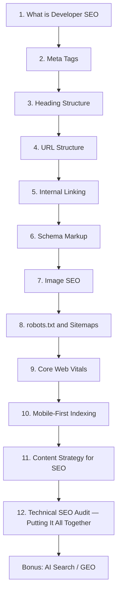

# Developer SEO Mastery — Curriculum

**Level:** Beginner → Intermediate → Advanced
**Estimated total time:** ~12 hours (12 lessons)
**Prerequisites:** Basic HTML, text editor, browser DevTools, ability to read HTTP headers

---

## How this curriculum is structured

Each lesson below is a complete paidagogos:micro topic. When a learner asks
"teach me [Lesson N title]", route them via paidagogos:micro and pass:
- `topic` = the exact lesson title
- `level` = the level listed
- estimated time = the minutes listed

Lesson 12 closes with the practical exercise that links back to the SEO plugin: running `/seo:audit` on a real site. This is the curriculum's payoff — the lessons teach the *what* and *why*, the plugin automates the *how-often*.

---

## Curriculum overview



The graph is a strict linear chain. Each lesson uses concepts from the one before. Skipping ahead produces gaps; revisit prior lessons if anything feels unfamiliar.

---

## Lesson 1 — What is Developer SEO

**Level:** beginner
**Estimated time:** 45 min
**Prerequisites:** none

### Concept
SEO is the discipline of making a website discoverable, crawlable, and rank-worthy for search engines. The developer's perspective is different from a marketer's: you control the HTML, the server's response, the URL structure, and the JavaScript that gates everything else. SEO failures live in code that the developer owns.

### Why
You'll use this when a site gets less traffic than expected, when a product launch is invisible to Google, or when marketing asks "why aren't we ranking". Knowing the search-engine pipeline (crawl → index → rank) lets you debug these questions from the code up rather than from guesswork down.

### Code example
```html
<!DOCTYPE html>
<html lang="en">
<head>
  <meta charset="UTF-8">
  <title>My App — Landing Page</title>
  <meta name="description" content="What your app does in 150 chars">
</head>
<body>
  <h1>Primary Heading (one per page)</h1>
</body>
</html>
```

### Mistakes
- Treating SEO as a marketing checkbox the developer can ignore — most ranking failures come from code.
- Skipping the `<title>` tag and relying on the first `<h1>` as the search-result headline.
- Using JavaScript to render content Google cannot see (no SSR / no pre-render = invisible).

### Generate
Open any small static site you maintain (a personal blog, a docs page). Open Chrome DevTools, view-source on the homepage, and identify the five pieces of SEO metadata you'd expect to find. List what you find vs what you expected.

### Quiz
1. What are the three stages of how a search engine processes a page? (crawl, index, rank)
2. Why do developers have an advantage in SEO? (they own the HTML and the server response)
3. What does E-E-A-T stand for? (Experience, Expertise, Authoritativeness, Trustworthiness)

### Resources
- [Google SEO Starter Guide (developers)](https://developers.google.com/search/docs/fundamentals/seo-starter-guide)
- [Google Search Central: SEO for Developers](https://developers.google.com/search/docs/fundamentals/get-started-developers)
- [HubSpot SEO Certification — 3.5 hrs, free, LinkedIn-shareable badge](https://academy.hubspot.com/courses/seo-training)
- [Ahrefs SEO Course for Beginners — 2 hrs, 14 lessons, free](https://ahrefs.com/academy)
- [Moz Beginner's Guide to SEO — industry standard](https://moz.com/beginners-guide-to-seo)
- [roadmap.sh Frontend — SEO listed as skill #6](https://roadmap.sh/frontend)

### Next
Lesson 2 — Meta Tags (title + description).

---

## Lesson 2 — Meta Tags

**Level:** beginner
**Estimated time:** 50 min
**Prerequisites:** Lesson 1

### Concept
The `<title>` and `<meta name="description">` tags are the two most important on-page ranking elements you control directly. Title length: 50–60 characters. Description: 150–160. One unique title per URL — duplicate titles do not combine ranking signals, they split them.

### Why
You'll use this when launching a new page, when a page's organic CTR is below expected, or when migrating content between templates and want to confirm the title is preserved.

### Code example
```html
<head>
  <!-- Good: 55 chars, keyword front-loaded -->
  <title>Blue Running Shoes | ShopNow</title>
  <!-- Good: 155 chars, includes CTA and offer -->
  <meta name="description" content="Shop blue running shoes from top brands. Free shipping on orders over $50. Find your perfect fit with our size guide.">
</head>
```

Common mistakes:
- Auto-generating titles as `"Page Title — Site Name"` (works at first; pathological at >60 chars)
- Treating meta description as a ranking factor (it is not — only CTR-impacting)
- One `<title>` per page guaranteed (every URL inherits from its head, not its parent page)

### Generate
Audit any e-commerce product page. Write a new title (50–60 chars) and description (150–160 chars) that includes the target keyword naturally and avoids truncation.

### Quiz
1. What is the ideal `<title>` length? (50–60 characters)
2. Does meta description directly affect rankings? (No — it affects CTR from search results)
3. Why must each page have a unique title? (duplicate titles split ranking signals)

### Resources
- [Google: Titles and Descriptions](https://developers.google.com/search/docs/appearance/title-link)
- [MDN: `<meta>` element](https://developer.mozilla.org/en-US/docs/Web/HTML/Element/meta)
- [Google Rich Results Test](https://search.google.com/test/rich-results) — covers structured-data validation, referenced from later lessons
- [PageSpeed Insights](https://pagespeed.web.dev/) — covered in Lesson 9

### Next
Lesson 3 — Heading Structure.

---

## Lesson 3 — Heading Structure

**Level:** beginner
**Estimated time:** 45 min
**Prerequisites:** Lesson 2

### Concept
`<h1>` through `<h6>` create a document outline. One `<h1>` per page is the convention — multiple `<h1>`s create ambiguity for crawlers and split topic relevance. Headings should be sequential: H1 → H2 → H3, no skipping.

### Why
You'll use this when restructuring content into reusable components, when migrating to a CMS that auto-generates headings, or when accessibility audits flag "heading not descriptive".

### Code example
```html
<h1>Complete Guide to Running Shoes</h1>
  <h2>How to Choose Running Shoes</h2>
    <h3>By Foot Type</h3>
    <h3>By Running Surface</h3>
  <h2>Top Running Shoe Brands</h2>
    <h3>Nike</h3>
    <h3>Advisors</h3>
```

(Note: in real production you avoid the visual indent — indentation here is for outline clarity only. Nesting is implied by document order, not by whitespace.)

### Mistakes
- Using `<h1>` per *section* of a page (each card / each widget) — Google sees this as multiple competing primary topics.
- Skipping levels (H1 → H3) for visual styling reasons. Use CSS for visual leveling; let heading numbers be sequential.
- Empty headings for spacing — use `margin` or `padding`, not blank `<h2>`.

### Generate
Audit headings on a blog post of your choice. Flag every level skip and every multiple-`<h1>` page.

### Quiz
1. How many `<h1>` elements should a page have? (exactly one)
2. Is `<h1>` → `<h3>` (skipping `<h2>`) valid HTML? (Valid HTML, but invalid SEO convention — flagged as warning by the SEO plugin)
3. Why is heading hierarchy important for accessibility? (Screen reader users rely on nesting to navigate)

### Resources
- [Google: Heading elements](https://developers.google.com/search/docs/fundamentals/seo-starter-guide#heading-tags)
- [MDN: Heading Elements](https://developer.mozilla.org/en-US/docs/Web/HTML/Element/Heading_Elements)
- [WebAIM: Semantic Structure](https://webaim.org/techniques/semanticstructure/) — accessibility overlap

### Next
Lesson 4 — URL Structure.

---

## Lesson 4 — URL Structure

**Level:** beginner
**Estimated time:** 40 min
**Prerequisites:** Lesson 3

### Concept
URLs should be readable, stable, descriptive, lowercase, hyphen-separated, and free of parameter IDs. Good URLs survive for years; bad URLs (with session IDs, query strings, capital letters) cascade into broken links.

### Why
You'll use this when designing a CMS, when refactoring an old site, or when integrating with a CDN that auto-rewrites paths.

### Code example
```
✅ /blue-running-shoes/nike-air-max
✅ /blog/2026/07/multi-page-crawl-launch
❌ /products?id=123&cat=shoes&color=blue
❌ /Blue_Running_Shoes/Nike_Air_Max
```

### Mistakes
- Case-sensitive URLs without redirects — `/Page` and `/page` become duplicate content.
- Using underscores (`/blue_running`) instead of hyphens — Google splits on hyphens, treats underscores as part of a word.
- Including session IDs or tracking parameters in canonical URLs.

### Generate
Take any public-facing URL from a real site you build. Identify the three improvements that would make it more crawlable.

### Quiz
1. Which separator should URLs use, hyphens or underscores? (hyphens — Google splits on them)
2. Should URLs be case-sensitive on your server? (No — configure case-insensitive routing or add permanent redirects)
3. Why avoid query-string IDs in canonical URLs? (they break link equity and look generic to crawlers)

### Resources
- [Google: URL structure guidelines](https://developers.google.com/search/docs/fundamentals/seo-starter-guide#url-structure)
- [RFC 3986: URI Generic Syntax](https://datatracker.ietf.org/doc/html/rfc3986) — canonical reference

### Next
Lesson 5 — Internal Linking.

---

## Lesson 5 — Internal Linking

**Level:** intermediate
**Estimated time:** 50 min
**Prerequisites:** Lesson 4

### Concept
Internal links distribute PageRank across your site. Anchor text tells crawlers what the target page is about. A hub-and-spoke model — pillar pages link out to topic clusters — produces stronger clusters than isolated pages.

### Why
You'll use this when designing site architecture, when reorganising categories, or when diagnosing why a new page is not indexing.

### Code example
```html
<!-- good: descriptive anchor -->
<a href="/running-shoes/cushioned">cushioned daily trainers</a>

<!-- bad: anchor text is the URL -->
<a href="/running-shoes/cushioned">https://example.com/running-shoes/cushioned</a>

<!-- bad: no signal -->
<a href="/running-shoes/cushioned">click here</a>
```

### Mistakes
- Linking with "click here" — wastes the most valuable on-page SEO signal.
- Putting critical pages more than 3 clicks from the homepage — crawl-budget dilution.
- Buried navigation: relying on footer links instead of visible in-context links.

### Generate
Pick a pillar page on your site. Audit its internal links: which 5 pages does it reference, which 5 reference it back? Compute the asymmetry.

### Quiz
1. What is the recommended maximum click-depth from the homepage? (≤3 clicks)
2. Why is "click here" anchor text wasteful? (it gives crawlers no signal about the target page's topic)
3. What is the hub-and-spoke model? (a central pillar page linking to and from cluster pages on the same topic)

### Resources
- [Ahrefs: Internal Linking for SEO](https://ahrefs.com/blog/internal-linking/)
- [Google: Site Architecture](https://developers.google.com/search/docs/fundamentals/seo-starter-guide#site-architecture)

### Next
Lesson 6 — Schema Markup.

---

## Lesson 6 — Schema Markup (Structured Data)

**Level:** intermediate
**Estimated time:** 60 min
**Prerequisites:** Lesson 5

### Concept
Schema.org + JSON-LD is Google's recommended structured-data format. The vocabulary encodes page purpose (Article, Product, Organization, FAQPage, HowTo, etc.) and required properties per type. Schema does not directly improve ranking — it enables *rich results* (stars, FAQ drops, breadcrumbs) which improve CTR.

### Why
You'll use this when launching an e-commerce catalog, when writing CMS templates that need to emit FAQ schema, or when debugging "no rich results" in Search Console.

### Code example
```json
{
  "@context": "https://schema.org",
  "@type": "Product",
  "name": "Nike Air Max 270",
  "image": "https://example.com/nike-air-max-270.jpg",
  "description": "Lightweight running shoe with Air Max unit",
  "brand": { "@type": "Brand", "name": "Nike" },
  "offers": {
    "@type": "Offer",
    "price": "150.00",
    "priceCurrency": "USD",
    "availability": "https://schema.org/InStock"
  }
}
```

### Mistakes
- Mixing up `@type` (Article vs BlogPosting vs NewsArticle) — search results treat each as a distinct surface.
- Emitting a deprecated rich-result type (`HowTo`, `SpecialAnnouncement`) — still valid schema.org, but Google no longer renders them as rich results. Flagged as a *warning*, not an error.
- Putting schema.org markup in a `<script>` tag without `type="application/ld+json"`.

### Generate
Visit a schema.org type page (e.g. https://schema.org/Article). Find one required property not in the basic Article example. Add it to a blog post sample.

### Quiz
1. What schema.org format does Google currently recommend? (JSON-LD)
2. Does adding schema directly improve search ranking? (No — enables rich results which improve CTR)
3. Name one schema type deprecated for Google rich results but still valid at schema.org. (HowTo, SpecialAnnouncement)

### Resources
- [Schema.org](https://schema.org) — full vocabulary
- [Google Structured Data Guide](https://developers.google.com/search/docs/appearance/structured-data/intro-structured-data)
- [JSON-LD Playground](https://json-ld.org/playground/) — test your markup
- [Google Rich Results Test](https://search.google.com/test/rich-results) — Google's validator
- [Semrush Structured Data Course (free)](https://www.semrush.com/academy/)

### Next
Lesson 7 — Image SEO.

---

## Lesson 7 — Image SEO

**Level:** intermediate
**Estimated time:** 45 min
**Prerequisites:** Lesson 6

### Concept
Image SEO touches on three layers: file-level (descriptive filename, modern format like WebP / AVIF, appropriate dimensions), HTML-level (alt text, loading attribute, decoding), and performance-level (CLS prevention via explicit width/height).

### Why
You'll use this when an image-heavy page has CLS issues, when Google Images traffic underperforms, or when Lighthouse audit flags "serve images in next-gen formats".

### Code example
```html

```

### Mistakes
- Auto-generated filenames (`IMG_001.jpg`) — supplant with descriptive kebab-case.
- Empty alt text on non-decorative images — assistive tech reads nothing, crawlers index nothing.
- Forgetting `width`/`height` and triggering CLS in Chrome — Lighthouse deducts.

### Generate
Audit the top 10 images on your most-viewed page. List which are missing alt text, which are missing dimensions, and which are above-the-fold (do not lazy-load those).

### Quiz
1. What attribute is critical to prevent CLS? (width and height attributes, even for responsive images)
2. Should you lazy-load above-the-fold images? (No — defeats the purpose, LCP suffers)
3. What is the recommended modern image format? (WebP or AVIF)

### Resources
- [Google: Image optimization](https://developers.google.com/search/docs/fundamentals/seo-starter-guide#images)
- [web.dev: Optimize images](https://web.dev/fast/#optimize-your-images)

### Next
Lesson 8 — robots.txt and XML Sitemaps.

---

## Lesson 8 — robots.txt and XML Sitemaps

**Level:** intermediate
**Estimated time:** 50 min
**Prerequisites:** Lesson 7

### Concept
`robots.txt` controls what crawlers are *allowed* to fetch; XML sitemaps declare what you *want indexed*. Both are communications with crawlers, not security boundaries. Misconfiguring either produces indexing disasters.

### Why
You'll use this when launching a new site, when migrating to a new domain, when rolling out new sections to be excluded from indexing, or when debugging "site not indexed".

### Code example
```
# robots.txt
User-agent: *
Disallow: /admin/
Disallow: /api/
Allow: /blog/
Sitemap: https://example.com/sitemap.xml
```

```xml
<!-- sitemap.xml -->
<?xml version="1.0" encoding="UTF-8"?>
<urlset xmlns="http://www.sitemaps.org/schemas/sitemap/0.9">
  <url>
    <loc>https://example.com/</loc>
    <lastmod>2026-07-01</lastmod>
    <changefreq>weekly</changefreq>
    <priority>1.0</priority>
  </url>
</urlset>
```

### Mistakes
- Blocking CSS or JS in robots.txt — Google needs them to render the page.
- Listing a `noindex`-tagged page in the sitemap — contradiction, crawler behaviour is undefined.
- `Disallow: /` (the whole site) on staging — frequently the staging robots.txt gets copied to prod.

### Generate
Find a robots.txt + sitemap pair from a real site. Identify three signals in the file (blocked paths, sitemap URL, any unusual directives).

### Quiz
1. Does robots.txt prevent indexing or just crawling? (crawling — pages can still be indexed if linked from elsewhere)
2. Why should you never block CSS/JS in robots.txt? (Google needs them to render the page properly)
3. What is the purpose of `<lastmod>` in sitemap.xml? (tells Google when content actually changed)

### Resources
- [Google: robots.txt specifications](https://developers.google.com/search/docs/crawling-indexing/robots/intro)
- [Google: Sitemaps overview](https://developers.google.com/search/docs/crawling-indexing/sitemaps/overview)
- [Bing: IndexNow for URL submission](https://www.bing.com/webmasters/help/how-to-submit-urls-to-bing-18120056) — instant indexing for supported engines

### Next
Lesson 9 — Core Web Vitals.

---

## Lesson 9 — Core Web Vitals

**Level:** intermediate
**Estimated time:** 60 min
**Prerequisites:** Lesson 8

### Concept
**Core Web Vitals** are three metrics Google ranks on directly:
- **LCP** (Largest Contentful Paint) — loading performance. *Good* < 2.5s.
- **INP** (Interaction to Next Paint) — interactivity. *Good* < 200ms.
- **CLS** (Cumulative Layout Shift) — visual stability. *Good* < 0.1.

Field data (CrUX, real users) is what Google uses; lab data (Lighthouse) is what you can run locally. They diverge. PageSpeed Insights combines both.

### Why
You'll use this when a page is ranking lower than its content warrants, when a redesign tanks CWV, or when Lighthouse audits fail in CI.

### Code example
```javascript
// Measure LCP via PerformanceObserver
new PerformanceObserver((entry) => {
  const lcp = entry.entries.at(-1);
  console.log('LCP:', lcp.startTime, lcp.element);
}).observe({ type: 'largest-contentful-paint', buffered: true });

// Measure CLS via PerformanceObserver
let clsValue = 0;
new PerformanceObserver((entry) => {
  for (const shift of entry.entries) {
    if (!shift.hadRecentInput) clsValue += shift.value;
  }
  console.log('CLS:', clsValue);
}).observe({ type: 'layout-shift', buffered: true });
```

### Mistakes
- Optimising only for Lighthouse (lab) ignoring CrUX (field) — a common trap when launching a marketing site demoed from a fast office connection.
- Lazy-loading above-the-fold images to "improve LCP" — actually delays LCP.
- Treating CLS as a single number to "fix" — it's a sum of shifts across the entire page lifetime.

### Generate
Run PageSpeed Insights on your home page (mobile, slow-4G emulation). Note the three CWV metrics and which tier (Good / Needs Improvement / Poor) each lands in.

### Quiz
1. What are the three Core Web Vitals? (LCP, INP, CLS)
2. What is the threshold for *Good* LCP? (< 2.5s)
3. Lab vs field — which does Google actually rank on? (field — CrUX), and where can you measure each? (lab: Lighthouse; field: PageSpeed Insights showing CrUX data and your local Network throttling)

### Resources
- [web.dev: Core Web Vitals](https://web.dev/articles/vitals) — official metrics
- [PageSpeed Insights](https://pagespeed.web.dev/)
- [Chrome DevTools Performance panel](https://developer.chrome.com/docs/devtools/performance) — local profiling
- [Google Lighthouse](https://developer.chrome.com/docs/lighthouse/overview) — automated audit
- [web.dev: Optimize LCP](https://web.dev/articles/optimize-lcp) and [web.dev: Optimize CLS](https://web.dev/articles/optimize-cls) — deep dives

### Next
Lesson 10 — Mobile-First Indexing.

---

## Lesson 10 — Mobile-First Indexing

**Level:** intermediate
**Estimated time:** 45 min
**Prerequisites:** Lesson 9

### Concept
Google uses the mobile version of your page for indexing and ranking — *not* the desktop version. Responsive design is the standard. Common mobile failures: small fonts, tap targets too close, content wider than the viewport, lazy-rendered primary content.

### Why
You'll use this when debugging "indexed but not mobile-friendly" reports, when designing for mobile-first layouts, or when auditing a CMS that serves different HTML to mobile bots.

### Code example
```html
<head>
  <meta name="viewport" content="width=device-width, initial-scale=1">
  <style>
    /* Tap targets ≥ 48x48px per accessibility recommendations */
    .button { min-width: 48px; min-height: 48px; padding: 12px 16px; }
    /* 16px min font size to prevent zoom-on-tap on iOS */
    body { font-size: 16px; }
  </style>
</head>
```

### Mistakes
- Mobile-only `<meta name="robots" content="noindex">` (accidentally demoting the whole site).
- `<meta name="viewport" content="width=1024">` (pinning mobile to desktop width — defeats mobile-first).
- Hiding important content on mobile via CSS — Google indexes what it sees, hidden content doesn't rank.

### Generate
Open Chrome DevTools, toggle device toolbar, set iPhone 12 emulation. Visit your homepage. List the three mobile-specific issues you observe.

### Quiz
1. Which version of your page does Google index? (the mobile version)
2. What is the recommended minimum tap-target size? (48x48 px)
3. Why is `<meta name="viewport" content="width=device-width">` required? (without it, mobile devices assume 980px viewport and shrink-to-fit)

### Resources
- [Google: Mobile-first indexing best practices](https://developers.google.com/search/docs/crawling-indexing/mobile/mobile-sites)
- [Google: Mobile-Friendly Test](https://search.google.com/test/mobile-friendly)
- [web.dev: Responsive Web Design](https://web.dev/learn/design/)

### Next
Lesson 11 — Content Strategy.

---

## Lesson 11 — Content Strategy for SEO

**Level:** intermediate
**Estimated time:** 50 min
**Prerequisites:** Lesson 10

### Concept
Search intent comes in four flavours: informational, navigational, commercial, transactional. Matching your content to intent is more important than keyword stuffing. Topical authority (clusters of related pages) outperforms isolated pages. E-E-A-T signals (Experience, Expertise, Authoritativeness, Trustworthiness) come from named authors, original data, and linkable claims.

### Why
You'll use this when a piece of content underperforms, when designing a content calendar, or when auditing thin / duplicate content.

### Code example (semantic HTML making intent explicit)
```html
<article>
  <header>
    <h1>How We Reduced LCP by 60%</h1>
    <p>By <a href="/authors/jane">Jane Doe</a>, published <time datetime="2026-07-13">July 13, 2026</time></p>
  </header>
  <p>Originally published data from our CDN logs...</p>
</article>
```

### Mistakes
- Treating content strategy as "publish more" rather than "match intent".
- Generic "Top 10" pages with no original data — Panda / Helpful Content penalties hit hardest here.
- Anonymous authorship without an About page — degrades E-E-A-T signals.

### Generate
Take a piece of your own content. Identify its search intent. Find three queries where it *should* rank but doesn't. Note the missing intent match.

### Quiz
1. What are the four search-intent flavours? (informational, navigational, commercial, transactional)
2. What does E-E-A-T abbreviate? (Experience, Expertise, Authoritativeness, Trustworthiness)
3. Why is topical authority (clusters) stronger than isolated pages? (internal-link density compounds relevance signals)

### Resources
- [Semrush Academy: SEO Fundamentals — free courses](https://www.semrush.com/academy/)
- [Ahrefs Academy: Keyword Research — free](https://ahrefs.com/academy)
- [HubSpot Academy: Content Strategy — free](https://academy.hubspot.com/)
- [Google Quality Rater Guidelines](https://static.googleusercontent.com/media/guidelines.raterhub.com) — how Google evaluates quality

### Next
Lesson 12 — Technical SEO Audit (the capstone).

---

## Lesson 12 — Putting It All Together — Technical SEO Audit

**Level:** advanced
**Estimated time:** 60 min
**Prerequisites:** Lessons 1–11

### Concept
A complete audit runs every prior lesson as a checklist. Errors → warnings → info; prioritise. Measure before-and-after scores on the same site to track fix progress. Use the `/seo:audit` plugin to automate the audit; treat the plugin output as the start of the audit, not the end.

### Audit checklist

```markdown
## Technical
- [ ] robots.txt valid, no CSS/JS blocks
- [ ] XML sitemap present, validated, all URLs return 200
- [ ] 0 4xx/5xx errors on crawled pages
- [ ] HTTPS enabled, no mixed content
- [ ] Mobile-friendly (viewport meta, tap targets ≥48px)
- [ ] Core Web Vitals — LCP <2.5s, INP <200ms, CLS <0.1

## On-Page
- [ ] Unique `<title>` (50–60 chars)
- [ ] Unique meta description (150–160 chars)
- [ ] Single `<h1>` with primary keyword
- [ ] Logical heading hierarchy (no skipped levels)
- [ ] Canonical URL set and self-referencing
- [ ] OG tags complete (og:title, og:description, og:image, og:url)
- [ ] Twitter Card present

## Content
- [ ] Alt text on all non-decorative images
- [ ] Internal links present, descriptive anchor text
- [ ] Sufficient content depth (matches search intent)
- [ ] E-E-A-T signals (named author, original data)

## Structured Data
- [ ] JSON-LD present with valid @context
- [ ] Correct @type (Article / Product / FAQPage / etc.)
- [ ] Required @type properties present
- [ ] No deprecated rich-result types
- [ ] Google Rich Results Test passes
```

### Why
You'll use this as a recurring exercise — *every* site, *every* major release. The audit closes the loop on Lessons 1–11.

### How `/seo:audit` maps to this checklist

The plugin runs 8 phases that *exactly* mirror the checklist above. Use it as the start of every audit:

| Phase | Plugin phase | Checklist section |
|-------|--------------|-------------------|
| 1 | Scaffold | (sets up the run) |
| 2 | Fetch HTML | (collects raw data) |
| 3 | Meta Audit | On-Page |
| 4 | Heading Audit | Content + On-Page |
| 5 | Schema Audit | Structured Data |
| 6 | Technical Check | Technical (partial — robots/sitemap/redirects) |
| 7 | Core Web Vitals | Technical (CWV subset) |
| 8 | Score + Report | (composite scoring + 4 output files) |

When the plugin flags a finding, navigate back to the corresponding lesson for the *why* and the *fix*.

### Generate — practical exercise (curriculum payoff)

Run the SEO plugin on your own site or one you maintain:

```bash
/seo:audit https://your-site.example.com
```

Review the four output files at `docs/sites/your-site-example-com/seo/`:
- `INDEX.md` — overall 0–100 score and Top 5 Issues
- `seo-report.md` — full findings with severities
- `technical-audit.md` — CWV + crawlability
- `on-page-audit.md` — meta + headings + schema

Document in a short note: your score, the top 5 issues, and the fix plan you will execute over the next week.

### Quiz
1. Why run audits before *and* after fixes? (to measure progress objectively — the same 0–100 score gives a before/after delta)
2. What does the `/seo:audit` plugin *not* cover that an expert SEO audit would? (intent-matching, content quality, link-profile authority)
3. What should you do when the plugin produces a finding you disagree with? (cross-reference the lesson it came from; the lesson explains the *rule*; if you still disagree, file a DECISIONS issue, not a silent override)

### Resources
- [Google Search Console](https://search.google.com/search-console) — production monitoring
- [Bing Webmaster Tools](https://www.bing.com/webmaster/tools)
- [Screaming Frog SEO Spider](https://www.screamingfrog.co.uk/seo-spider/) — desktop crawler (free up to 500 URLs)
- [SEO Plugin: /seo:audit](plugins/seo/) — automate this checklist

---

## Bonus — AI Search / GEO (Generative Engine Optimization)

**Level:** intermediate
**Estimated time:** 30 min
**Prerequisites:** Lesson 6 (Schema) and Lesson 9 (Core Web Vitals)

### Concept
AI search engines (Perplexity, ChatGPT search, Google AI Overviews) cite pages with the cleanest structured comparable data. GEO (Generative Engine Optimization) extends SEO targets toward *citation-worthiness*: an llms.txt at the root, explicit AI-crawler policy in robots.txt, comparable entity URLs, and stable facts.

### Why
You'll use this when building a site that depends on discoverability through AI search — informational content, product catalogs, niche B2B sites.

### Quick wins

1. **`llms.txt` at site root** — `https://example.com/llms.txt` describing what the site is, its data coverage, canonical URL patterns, and citation policy. Mirror Google's existing sitemap model.
2. **AI-crawler policy** — explicitly `Allow` `GPTBot`, `ClaudeBot`, `PerplexityBot`, `Google-Extended` in robots.txt. Blocking them contradicts the goal of being cited.
3. **Entity-URL audit** — every cited entity (pen, ink, paper, shop) needs a stable, guessable URL. `https://example.com/pens/pilot-custom-823` beats `https://example.com/items/12345`.

### Resources
- [HubSpot: AEO Fundamentals Certification · free](https://academy.hubspot.com/courses/aeo-fundamentals-certification-en)
- [Semrush: AI Search Courses](https://www.semrush.com/academy/)
- [Google AI Optimization Guide](https://developers.google.com/search/docs/fundamentals/ai-optimization-guide)

---

## Curriculum metadata

| Field | Value |
|-------|-------|
| Catalog file | `plugins/paidagogos/skills/paidagogos-micro/references/curricula/seo-developer-mastery.md` |
| Audit-tool consumer | `/seo:audit` from `plugins/seo/` |
| Total lessons | 12 + 1 bonus |
| Total time | ~12 hours |
| PLUGIN reference | `docs/plugins/seo/` (plan, design, ROADMAP, instructions) |
| Linear tracking | PIL-121 (Task 15 of `docs/superpowers/plans/2026-07-12-seo-plugin.md`) |

When `paidagogos:path` ships (v2 of the paidagogos plugin), this catalog file will be the input the path planner parses to wire lessons into the path-discovery surface.
